# Hospital Platform 完整体业务流程图

> 审计基线：2026-08-24。本文按当前工作区实际注册的路由、页面事件、service、domain、adapter、repository 和 worker 绘制；“代码文件存在”不等于“用户入口已开放”。

## 1. 先看结论

- 患者端主链路：原生微信小程序 → 公网 Nginx `/api/v2` → Elysia 内部 `/api/v1` → 认证/业务 service → domain contract → MySQL/Redis 或 Provider adapter。
- 当前实际开放的患者端业务以“登录、患者目录同步、预约只读目录、预约历史/爽约只读、报告目录/部分检验详情、门诊费用只读、普通资料”为主。
- 预约下单、锁号、取消、挂号费、医保结算、门诊缴费调起、报告下载/分享/复诊、健康百科公共挂载、智能服务等没有被当前代码证明为可用。
- 支付 API、微信通知验签解密、outbox 和查单 worker 已有代码边界，但 `WECHAT_PAYMENT_READY`/完整配置/真实验收同时满足前，运行时保持 fail-closed；当前小程序门诊费用页面不调用 `wx.requestPayment`。
- `.codegraph/` 当前不存在，也没有可调用的 codeGraph 服务；本文的“调用图”由实际 import、路由注册、页面事件和跨层方法调用重建。

## 2. 图例

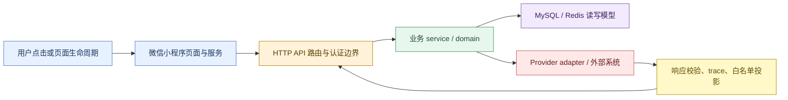

## 3. 总体架构与真实可达边界

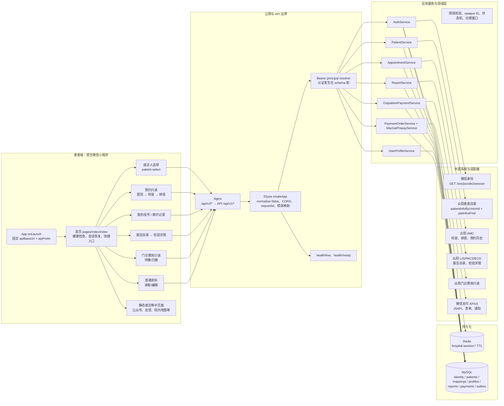

## 4. 启动、健康检查与 API 运行时闸门

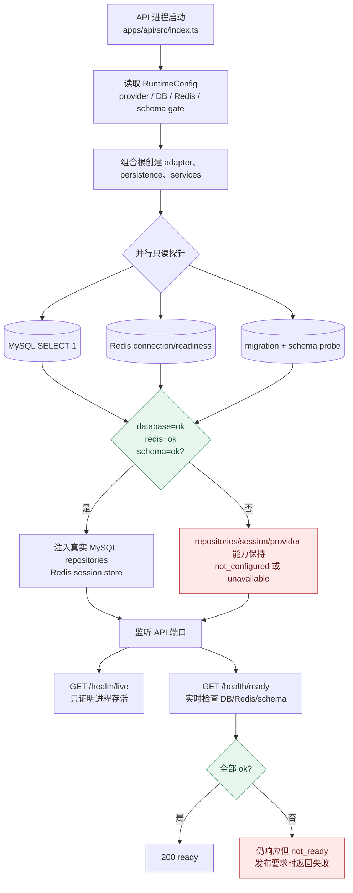

关键事实：readiness 不是业务成功证明；schema 未通过时，API 可以继续提供 health/readiness，但业务 repositories 不会被伪装成可用。每个受保护请求还要经过 Bearer session 校验，Redis 故障返回暂时不可用，不能被错误映射成“用户未登录”。

## 5. 用户登录与会话恢复

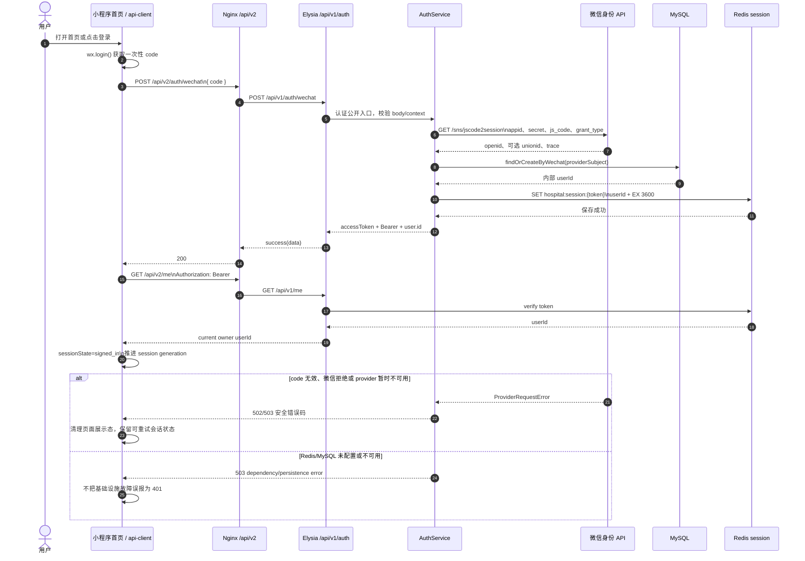

登录之后的首页初始化不是“拿到 token 就完成”：

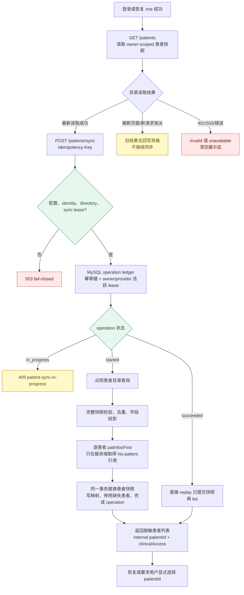

患者同步的关键数据边界：

- 小程序只提交 `wx.login` code、内部 opaque `patientId` 和幂等键；不提交 unionId、openid、身份证号或 Provider 患者号。
- 众阳目录通常先走 `/api/public/patientInfoByUnionId`，再按患者资料走 `/msun-middle-aggregate-patient/v1/patInfosFind`；`his-patient` 映射只保存在服务端。
- 完整快照缺失的患者会被标记 inactive，不物理删除，以保留历史订单/报告等外键语义；缺失 `his-patient` 映射的患者 `clinicalAccess` 不再是 ready。

## 6. 首页点击分流

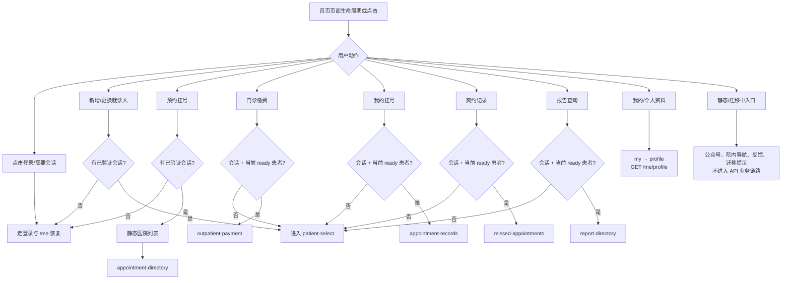

页面侧所有受保护业务读取都遵循同一组合原则：先 `GET /me` 确认 owner，再 `GET /patients` 解析当前显式选择，再以同一 session generation 发起 patient-scoped 查询；请求前后都检查页面 request guard、会话代际和当前 `patientId`，过期响应不得回写页面。

## 7. 预约只读目录

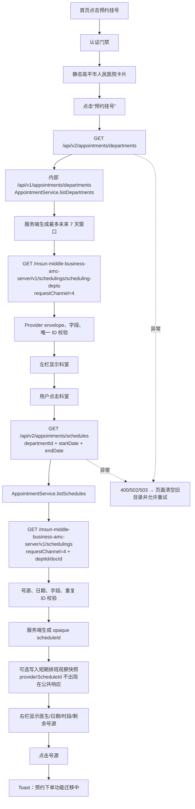

当前没有从该页面触发的预约写入 API。`POST /appointments`、锁号、取消和挂号费在 runtime smoke 中属于刻意关闭边界，不能把 `scheduleId` 解释成已经获得 Provider 写入授权。

## 8. 我的挂号与爽约记录

```mermaid
flowchart LR
    Records[我的挂号] --> RQuery[GET /api/v2/appointments/records\npatientId + startDate/endDate]
    Missed[爽约记录] --> MQuery[同一 GET 路由\n过去 90 天窗口]
    RQuery --> Service[AppointmentService.listRecords\nowner 来自 Bearer]
    MQuery --> Service
    Service --> Ref[MySQL resolveProviderReference\nprovider=zhongyang\nreferenceKind=his-patient]
    Ref --> RefOK{映射存在且 owner/patient 匹配?}
    RefOK -->|否| NotFound[业务错误：当前患者暂无可查询记录]
    RefOK -->|是| Provider[GET /msun-middle-business-appointment-server/v1/appointment-infos/{patId}\nrequestChannel=3、isMzFlag=1、dateFlag=1]
    Provider --> Validate[字段/日期/重复记录/trace 校验]
    Validate --> View[只返回平台预约摘要\n小程序本地分页/筛选]
    View --> Detail[点击记录]
    Detail --> DetailNotOpen[Toast：挂号详情暂未开放]
    View --> Actions[预问诊、全部挂号等未开放动作\n显示迁移提示]
```

“我的挂号”覆盖中国标准时间前后各 90 天；“爽约记录”只覆盖过去 90 天。两者复用 Provider 记录接口，但页面和 service 的窗口语义不同，未知窗口不会静默降级为普通历史查询。

## 9. 报告目录与检验详情

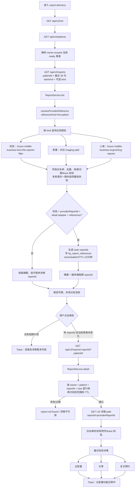

影像与心电当前只证明目录适配器存在；详情页的已接入路径是检验详情。报告目录请求的 Provider 结果不是“有一条成功就返回”，未指定 `kind` 时三路结果会合并，任一路响应异常都保持整批 fail-closed，避免把缺失报告伪装成空列表。

## 10. 门诊费用只读链路

```mermaid
flowchart TD
    OpenFee[进入 outpatient-payment] --> Context[GET /me → GET /patients\n确认 owner + ready patient]
    Context --> Tab[点击“待缴费”或“已缴费”]
    Tab --> Query[GET /api/v2/payments/outpatient/records\npatientId + status=unpaid|paid]
    Query --> Service[OutpatientPaymentService.list]
    Service --> Window[按 Asia/Shanghai 生成最近 30 个自然日窗口]
    Window --> Ref[resolveProviderReference\nreferenceKind=his-patient]
    Ref --> Provider[GET /msun-middle-open-settlepay/v1/outpatient-payments/outpatient-child-payment-records\npatId + startTime/endTime + authSysCode]
    Provider --> StatusMap[unpaid→tradeStatus=1\npaid→tradeStatus=3]
    StatusMap --> Validate[账单日期、金额分、状态和 trace 校验]
    Validate --> FeeUI[展示金额、日期、科室/医生、已缴/待缴摘要]
    FeeUI --> Tap[点击账单]
    Tap --> Local[当前仅本地查看/提示\n不调用 wx.requestPayment]
    FeeUI --> ChangePatient[更换就诊人]
    ChangePatient --> Context
```

该 adapter 明确是“门诊费用只读”，不承载支付调起、医保结算或退款。Provider 返回窗口外账单时整批拒绝，而不是静默过滤，以免用户看到不完整的账本。

## 11. 普通资料与“我的”页面

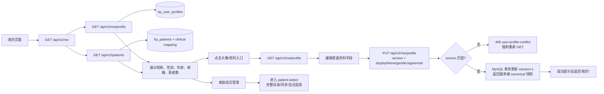

头像、手机号、真实姓名、身份证等字段不会借普通资料接口写入；“我的挂号、爽约记录、门诊缴费”在没有当前 ready 患者时会进入就诊人选择页，而不是先发一个必然失败的业务请求。

## 12. 支付、微信通知与 worker 补偿链路（代码存在，默认关闭）

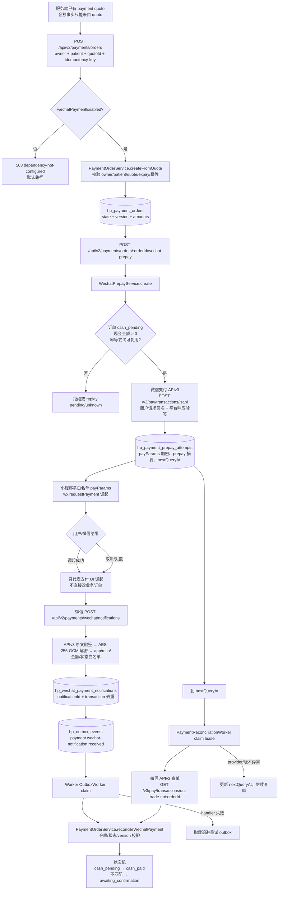

支付状态只能沿 `packages/domain/src/payment-state.ts` 的显式边迁移；前端调起成功、一次 HTTP 200 或未验签的 Provider 结果都不等于业务完成。Worker 只有在完整支付配置、持久化密钥、DB/schema 探针全部通过后才进入 provider 循环。

## 13. 统一错误与旧响应保护

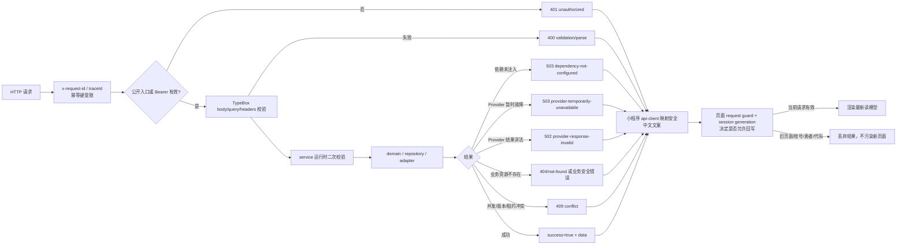

保护规则贯穿各层：HTTP 层不静默吞掉未知字段，service 不依赖 TypeScript 类型作为运行时事实，adapter 白名单投影 Provider 响应，页面不把旧患者/旧账号响应写回当前页面，错误文案不直接展示 Provider 原文。

## 14. 当前页面和 API 能力矩阵

| 用户入口 / 动作 | 实际调用 | 当前状态 | 关键边界 |
| --- | --- | --- | --- |
| 首页打开 | `GET /health/live`；有缓存 token 时 `GET /me`、`GET /patients` | 已实现 | live 不等于 ready；恢复失败清空展示态 |
| 微信登录 | `POST /auth/wechat` → 微信 `code2session` → Redis session | 已实现但需真实配置/真机验收 | 小程序只提交 code；provider secret 不出服务端 |
| 新增/更换就诊人 | `GET /patients`、`POST /patients/sync` | 已实现边界 | operation ledger、租约、完整快照、临床映射 |
| 预约科室 | `GET /appointments/departments` → 众阳 AMC | 只读已实现 | 服务端最多未来 7 天；无写入 |
| 预约排班 | `GET /appointments/schedules` → 众阳 AMC | 只读已实现 | 生成 opaque `scheduleId`；排班快照为未来前置事实 |
| 点击号源下单 | 无真实写入请求 | 未开放 | 页面 Toast“预约下单功能迁移中” |
| 我的挂号 | `GET /appointments/records` → 众阳预约记录 | 只读已实现 | 过去/未来 90 天窗口 |
| 爽约记录 | 同一 `GET /appointments/records` | 只读已实现 | 仅过去 90 天；不是另一个 Provider endpoint |
| 报告目录 | `GET /reports` → LIS/PACS/ECG 三路目录 | 只读已实现 | 最近 30 天；三路聚合整批校验 |
| 检验详情 | `GET /reports/:reportId` → 短期引用 → LIS detail | 条件开放 | 详情 gate、引用 TTL、owner+patient+reportId 三重绑定 |
| 云影像/分享/复诊 | 无真实接口 | 未开放 | 详情页只显示迁移提示 |
| 门诊费用 | `GET /payments/outpatient/records` → 众阳费用只读 | 只读已实现 | 最近 30 天、unpaid/paid；不调支付 |
| 普通资料读取 | `GET /me/profile` | 已实现 | canonical read model |
| 普通资料保存 | `PUT /me/profile` | 已实现 | version 乐观并发控制；未知字段拒绝 |
| 微信支付订单/预支付 | `/payments/orders*`、`/wechat-prepay` | 代码存在、默认关闭 | quote 金额、幂等、APIv3 签名/验签、通知闭环 |
| 微信支付通知 | `POST /payments/wechat/notifications` | 代码存在、默认关闭 | 验签、解密、白名单、去重、outbox |
| 支付补偿 worker | outbox + 查单 | 代码存在、默认 inactive | 完整配置/DB/schema/密钥 gate |
| 健康百科 | `apps/api/src/modules/knowledge` 文件存在 | 当前不可达 | `app.ts` 未挂载 module，不能写成公共 API 已开放 |
| 智能客服/导诊/互联网医院 | 页面入口或迁移提示 | 未迁移/静态 | 不把 UI 占位当作后端能力 |
| 院内导航 | 本地地图 + `wx.previewImage` | 静态已实现 | 无实时路线、楼层定位或导航 API |
| 意见反馈 | 静态问题 + 电话拨号 | 无在线工单 | 点击反馈只 Toast，不代表已提交 |

## 15. 源码索引

| 层 | 关键入口 |
| --- | --- |
| 小程序页面 | [`apps/miniprogram/src/app.json`](../../apps/miniprogram/src/app.json)、[`pages/index/index.ts`](../../apps/miniprogram/src/pages/index/index.ts)、[`services/api-client.ts`](../../apps/miniprogram/src/services/api-client.ts)、[`services/session-service.ts`](../../apps/miniprogram/src/services/session-service.ts)、[`services/dashboard-service.ts`](../../apps/miniprogram/src/services/dashboard-service.ts) |
| API 组合根 | [`apps/api/src/app.ts`](../../apps/api/src/app.ts)、[`apps/api/src/application.ts`](../../apps/api/src/application.ts)、[`apps/api/src/index.ts`](../../apps/api/src/index.ts) |
| API 路由 | [`apps/api/src/modules/auth/index.ts`](../../apps/api/src/modules/auth/index.ts)、[`patients/index.ts`](../../apps/api/src/modules/patients/index.ts)、[`appointments/index.ts`](../../apps/api/src/modules/appointments/index.ts)、[`reports/index.ts`](../../apps/api/src/modules/reports/index.ts)、[`outpatient-payments/index.ts`](../../apps/api/src/modules/outpatient-payments/index.ts)、[`payments/index.ts`](../../apps/api/src/modules/payments/index.ts)、[`profile/index.ts`](../../apps/api/src/modules/profile/index.ts) |
| 业务 service | `apps/api/src/modules/*/service.ts`；门诊费用 service 与 route 同在 `outpatient-payments/index.ts` |
| 外部适配器 | [`packages/adapters/src/wechat-identity.ts`](../../packages/adapters/src/wechat-identity.ts)、[`wechat-pay.ts`](../../packages/adapters/src/wechat-pay.ts)、[`zhongyang-patients.ts`](../../packages/adapters/src/zhongyang-patients.ts)、[`zhongyang-appointments.ts`](../../packages/adapters/src/zhongyang-appointments.ts)、[`zhongyang-reports.ts`](../../packages/adapters/src/zhongyang-reports.ts)、[`zhongyang-outpatient-payments.ts`](../../packages/adapters/src/zhongyang-outpatient-payments.ts) |
| 持久化 | [`packages/persistence/src/runtime.ts`](../../packages/persistence/src/runtime.ts)、[`mysql-repositories.ts`](../../packages/persistence/src/mysql-repositories.ts)、[`redis-session.ts`](../../packages/persistence/src/redis-session.ts)、[`migrations/`](../../packages/persistence/migrations/) |
| Worker | [`apps/worker/src/runtime.ts`](../../apps/worker/src/runtime.ts)、[`outbox-worker.ts`](../../apps/worker/src/outbox-worker.ts)、[`payment-reconciliation-worker.ts`](../../apps/worker/src/payment-reconciliation-worker.ts)、[`wechat-payment-notification-handler.ts`](../../apps/worker/src/wechat-payment-notification-handler.ts) |
| 运行边界 | [`infra/nginx/test-hp.meiyi.pro.conf.example`](../../infra/nginx/test-hp.meiyi.pro.conf.example)、[`README.md`](../../README.md)、[`docs/migration/api-matrix.md`](../migration/api-matrix.md) |
