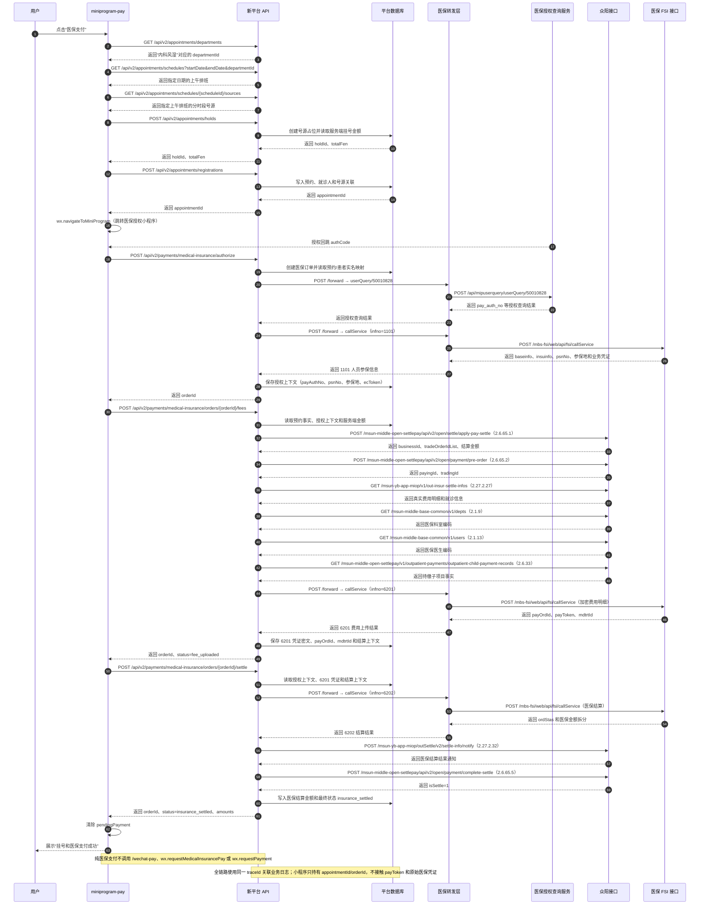

# miniprogram-pay 纯医保支付全流程

> 本图只展示用户点击“医保支付”后的单次成功调用链，不展开取消、重试、异常和自费/混合支付分支。

```mermaid
sequenceDiagram
    autonumber
    participant U as 用户
    participant MP as miniprogram-pay
    participant API as 新平台 API
    participant DB as 平台数据库
    participant R as 医保转发层
    participant AUTH as 医保授权查询服务
    participant ZY as 众阳接口
    participant FSI as 医保 FSI 接口

    U->>MP: 点击“医保支付”

    MP->>API: GET /api/v2/appointments/departments
    API-->>MP: 返回“内科风湿”对应的 departmentId
    MP->>API: GET /api/v2/appointments/schedules?startDate&endDate&departmentId
    API-->>MP: 返回指定日期的上午排班
    MP->>API: GET /api/v2/appointments/schedules/{scheduleId}/sources
    API-->>MP: 返回指定上午排班的分时段号源

    MP->>API: POST /api/v2/appointments/holds
    API->>DB: 创建号源占位并读取服务端挂号金额
    DB-->>API: 返回 holdId、totalFen
    API-->>MP: 返回 holdId、totalFen

    MP->>API: POST /api/v2/appointments/registrations
    API->>DB: 写入预约、就诊人和号源关联
    DB-->>API: 返回 appointmentId
    API-->>MP: 返回 appointmentId

    MP->>MP: wx.navigateToMiniProgram（跳转医保授权小程序）
    AUTH-->>MP: 授权回跳 authCode

    MP->>API: POST /api/v2/payments/medical-insurance/authorize
    API->>DB: 创建医保订单并读取预约/患者实名映射
    API->>R: POST /forward → userQuery/50010828
    R->>AUTH: POST /api/mipuserquery/userQuery/50010828
    AUTH-->>R: 返回 pay_auth_no 等授权查询结果
    R-->>API: 返回授权查询结果
    API->>R: POST /forward → callService（infno=1101）
    R->>FSI: POST /mbs-fsi/web/api/fsi/callService
    FSI-->>R: 返回 baseinfo、insuinfo、psnNo、参保地和业务凭证
    R-->>API: 返回 1101 人员参保信息
    API->>DB: 保存授权上下文（payAuthNo、psnNo、参保地、ecToken）
    API-->>MP: 返回 orderId

    MP->>API: POST /api/v2/payments/medical-insurance/orders/{orderId}/fees
    API->>DB: 读取预约事实、授权上下文和服务端金额
    API->>ZY: POST /msun-middle-open-settlepay/api/v2/open/settle/apply-pay-settle（2.6.65.1）
    ZY-->>API: 返回 businessId、tradeOrderIdList、结算金额
    API->>ZY: POST /msun-middle-open-settlepay/api/v2/open/payment/pre-order（2.6.65.2）
    ZY-->>API: 返回 payingId、tradingId
    API->>ZY: GET /msun-yb-app-miop/v1/out-insur-settle-infos（2.27.2.27）
    ZY-->>API: 返回真实费用明细和就诊信息
    API->>ZY: GET /msun-middle-base-common/v1/depts（2.1.9）
    ZY-->>API: 返回医保科室编码
    API->>ZY: GET /msun-middle-base-common/v1/users（2.1.13）
    ZY-->>API: 返回医保医生编码
    API->>ZY: GET /msun-middle-open-settlepay/v1/outpatient-payments/outpatient-child-payment-records（2.6.33）
    ZY-->>API: 返回待缴子项目事实
    API->>R: POST /forward → callService（infno=6201）
    R->>FSI: POST /mbs-fsi/web/api/fsi/callService（加密费用明细）
    FSI-->>R: 返回 payOrdId、payToken、mdtrtId
    R-->>API: 返回 6201 费用上传结果
    API->>DB: 保存 6201 凭证密文、payOrdId、mdtrtId 和结算上下文
    API-->>MP: 返回 orderId、status=fee_uploaded

    MP->>API: POST /api/v2/payments/medical-insurance/orders/{orderId}/settle
    API->>DB: 读取授权上下文、6201 凭证和结算上下文
    API->>R: POST /forward → callService（infno=6202）
    R->>FSI: POST /mbs-fsi/web/api/fsi/callService（医保结算）
    FSI-->>R: 返回 ordStas 和医保金额拆分
    R-->>API: 返回 6202 结算结果
    API->>ZY: POST /msun-yb-app-miop/outSettle/v2/settle-info/notify（2.27.2.32）
    ZY-->>API: 返回医保结算结果通知
    API->>ZY: POST /msun-middle-open-settlepay/api/v2/open/payment/complete-settle（2.6.65.5）
    ZY-->>API: 返回 isSettle=1
    API->>DB: 写入医保结算金额和最终状态 insurance_settled
    API-->>MP: 返回 orderId、status=insurance_settled、amounts

    MP->>MP: 清除 pendingPayment
    MP-->>U: 展示“挂号和医保支付成功”

    Note over MP,API: 纯医保支付不调用 /wechat-pay、wx.requestMedicalInsurancePay 或 wx.requestPayment
    Note over API,DB: 全链路使用同一 traceId 关联业务日志；小程序只持有 appointmentId/orderId，不接触 payToken 和原始医保凭证
```
