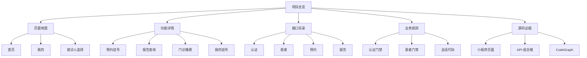
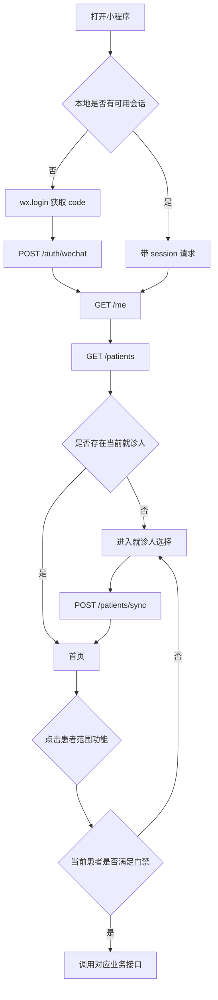

# 项目总览

这是一个医疗服务小程序和 API 服务组成的项目。用户端从微信登录开始，先获得当前用户，再选择或同步就诊人，之后才允许进入预约、报告、门诊费用等患者范围业务。

## 一眼看懂的导航树

## 用户主链路

## 顶层入口

| 入口 | 详细说明 |
| --- | --- |
| [[首页]] | 当前源码统计 32 个视觉点击位；包括患者卡、预约、缴费、报告、挂号记录、服务栅格、底部导航。 |
| [[我的]] | 当前源码统计 15 个视觉点击位；包括资料、家庭成员、挂号记录、爽约记录、意见反馈和底部导航。 |
| [[就诊人选择]] | 选择已有患者或通过二维码同步患者，是患者范围业务的公共前置。 |
| [[预约目录]] | 固定医院展示页之后的科室、日期、排班只读入口；排班点击暂未下单。 |
| [[报告目录]] | 当前就诊人名下报告列表及报告详情入口。 |
| [[二级页面索引]] | 个人资料、预约记录、爽约、门诊费用、反馈、静态说明等页面的完整索引。 |

## 关键规则入口

- [[认证门禁|认证门禁]]：请求什么时候需要登录，登录失败如何恢复。
- [[患者门禁|患者门禁]]：为什么很多首页功能在没有患者时不能继续。
- [[会话代际与旧响应|会话代际与旧响应]]：登录恢复后，为什么旧请求不能覆盖新状态。
- [[报告短期引用|报告短期引用]]：为什么报告详情不是简单把任意 reportId 直接传给供应商。
- [[错误码与页面行为|错误码与页面行为]]：接口错误如何变成用户可理解的页面动作。

## 代码入口

| 层 | 入口 |
| --- | --- |
| 小程序页面 | [index.ts](../../apps/miniprogram/src/pages/index/index.ts)、[my.ts](../../apps/miniprogram/src/pages/my/my.ts) |
| 小程序请求层 | [api-client.ts](../../apps/miniprogram/src/services/api-client.ts) |
| API 组合根 | [app.ts](../../apps/api/src/app.ts) |
| API 患者模块 | [patients/index.ts](../../apps/api/src/modules/patients/index.ts) |
| API 预约模块 | [appointments/index.ts](../../apps/api/src/modules/appointments/index.ts) |
| API 报告模块 | [reports/index.ts](../../apps/api/src/modules/reports/index.ts) |
| 现有完整流程 | [hospital-platform-complete-flow.md](../architecture/hospital-platform-complete-flow.md) |

## 阅读边界

这里记录的是当前仓库静态源码能证明的行为。供应商真实可用性、微信后台配置、真实设备 UI 和生产网络链路，仍需要运行验证；不要把“代码存在”误读为“外部依赖一定已开通”。
