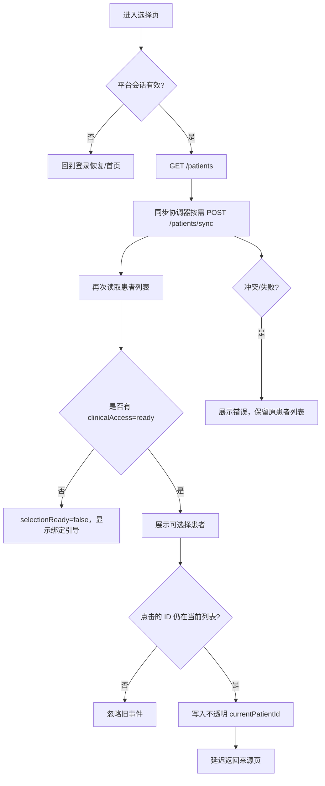

# 就诊人选择

这是预约记录、报告、门诊缴费等患者范围功能共用的前置页面。它维护的是“当前平台账号选择了哪个已绑定患者”，不是把客户端传来的患者 ID 当成权限证明。

## 用户能做什么

| 操作 | 触发 | 结果 | 判断 |
| --- | --- | --- | --- |
| 查看患者 | 进入页、页面重新显示、下拉刷新 | 读取 `/patients`，并等待本轮临床目录同步完成 | 必须有有效平台会话 |
| 点击已有患者 | 点击患者卡片 | 仅允许 `clinicalAccess=ready` 的患者写入当前选择并返回 | 患者必须仍在本轮列表中 |
| 添加/绑定 | 点击添加按钮 | 弹窗提示医院绑定接口正在迁移中，不启动真实扫码或写入 | 当前只有迁移提示 |
| 重新同步 | 页面加载阶段触发 | `POST /patients/sync`，带幂等键，完成后再次读列表 | 同步中禁止重复发起 |
| 取消 | 点击取消或返回 | 不改变当前患者上下文 | 不产生业务写入 |

## 实际逻辑链

## 安全和维护边界

- 只有 `clinicalAccess === "ready"` 的患者可以成为当前患者；`unavailable` 不能被当作可查询患者。
- 页面不从客户端传入医院、机构、provider 字段；这些字段由服务端/适配器规范化。
- 同步请求必须带 `idempotency-key`，页面级和服务级都使用单飞/代际保护，防止快速进入、刷新时重复绑定。
- 如果没有临床可用患者，页面可以显示“暂无可用就诊人”，不能把空列表当成接口失败。

接口：[[患者-列表]]、[[患者-同步]]、[[患者门禁]]、[[会话代际与旧响应]]。

源码：[patient-select.ts](../../../apps/miniprogram/src/pages/patient-select/patient-select.ts)。
