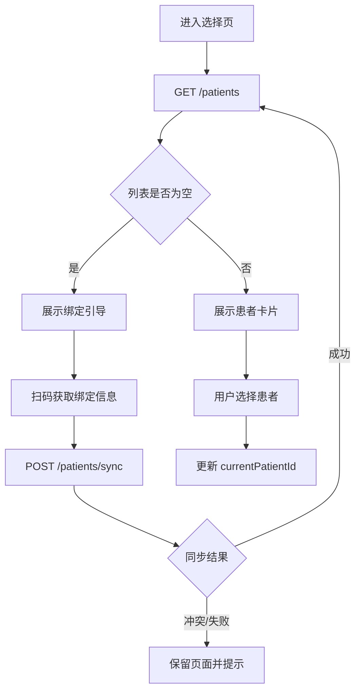

# 就诊人选择

这是预约、报告、门诊缴费等患者范围功能共用的前置页面。

## 用户能做什么

| 操作 | 结果 |
| --- | --- |
| 点击已有就诊人 | 写入当前患者上下文，返回来源页面或首页 |
| 点击添加/绑定 | 进入二维码扫描或同步流程 |
| 取消选择 | 保留当前页面，不伪造患者上下文 |
| 同步成功 | 刷新患者列表，再回到选择状态 |
| 同步冲突/失败 | 展示可理解的错误，不覆盖原有患者 |

## 逻辑链

接口：[[03-接口目录/患者-列表|患者列表]]、[[03-接口目录/患者-同步|患者同步]]。

