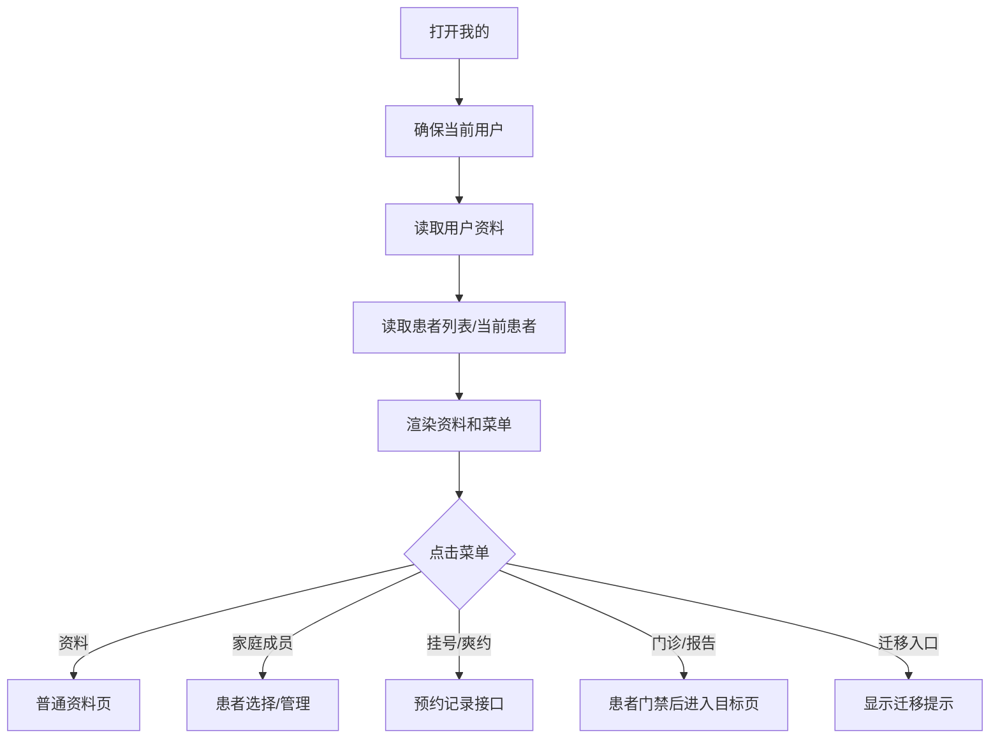

# 我的：功能地图

> 统计口径：当前源码中可见 15 个视觉点击位：资料头部 1、家庭成员卡片 1、菜单项 9、底部导航 4。菜单里有些点击位目前只有迁移/建设中反馈。

源码：[my.ts](../../../apps/miniprogram/src/pages/my/my.ts)。

## 点击位总览

| 区域 | 数量 | 具体入口 |
| --- | ---: | --- |
| 个人资料头部 | 1 | 头像/姓名/资料入口 |
| 家庭成员卡片 | 1 | [[我的-家庭成员|家庭成员与就诊人]] |
| 第一组菜单 | 4 | 我的挂号、我的问诊、门诊病历、电子导诊单 |
| 第二组菜单 | 2 | 我的医生、爽约记录 |
| 第三组菜单 | 3 | 意见反馈、智能客服、医保电子凭证 |
| 底部导航 | 4 | 首页、服务、消息、我的 |
| **合计** | **15** |  |

## 我的功能表

| 功能 | 点击后 | 接口/规则 | 状态 |
| --- | --- | --- | --- |
| 个人资料 | 打开资料页或资料编辑 | [[我的-个人资料|普通资料读写]] | 实际可用 |
| 家庭成员 | 打开患者选择/管理 | [[患者-列表|患者列表]]、[[患者-同步|患者同步]] | 实际可用 |
| 我的挂号 | 打开预约记录 | [[我的-我的挂号|详情]] | 实际可用 |
| 爽约记录 | 打开爽约记录 | [[我的-爽约记录|详情]] | 实际可用 |
| 我的问诊 | 迁移提示 | 无当前业务接口 | 迁移中 |
| 门诊病历 | 迁移提示 | [[首页-门诊病历|详情]] | 迁移中 |
| 电子导诊单 | 迁移提示 | 无当前业务接口 | 建设中 |
| 我的医生 | 迁移提示 | 无当前业务接口 | 迁移中 |
| 意见反馈 | 打开反馈页 | [[我的-意见反馈|详情]] | 页面存在/提交待验证 |
| 智能客服 | 迁移提示 | 无当前业务接口 | 迁移中 |
| 医保电子凭证 | 独立授权提示 | 无当前业务接口 | 暂未开放 |
| 服务/消息 | 迁移或建设中提示 | 无当前业务接口 | 迁移中 |
| 我的 tab | 保持当前页 | 无接口 | 实际可用 |
| 首页 tab | 返回首页 | 无接口 | 实际可用 |

## 我的页面判断

## 页面级注意事项

- “我的”里显示了入口，不代表每个入口都有完整业务实现；要以功能详情中的状态为准。
- 门诊缴费和报告查询虽然位于个人中心，仍然复用患者范围门禁。
- 当前用户和患者读取属于页面进入的准备阶段，不能当作用户主动点击的业务接口。
