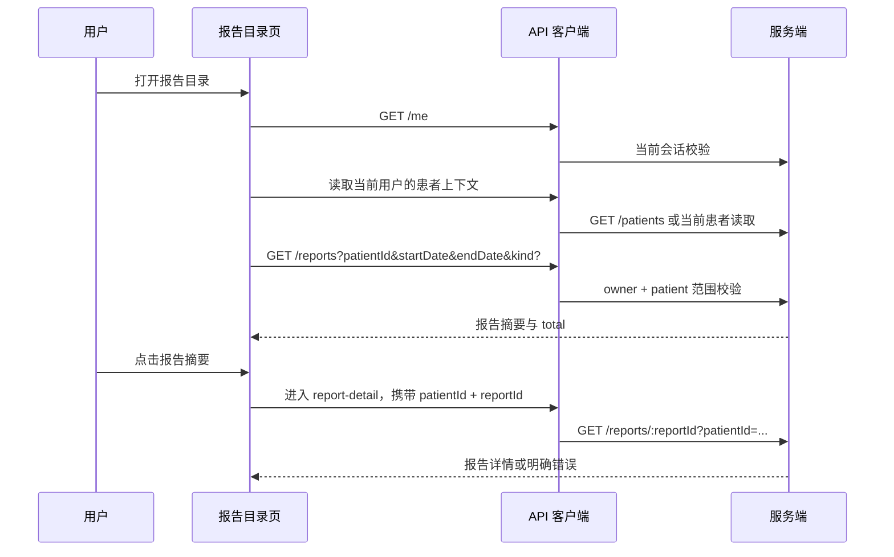

# 报告目录

报告目录是“当前登录用户 → 当前就诊人 → 报告摘要列表”的患者范围页面。首页右侧“报告查询”进入这里；页面不会把报告列表直接当成详情，点击摘要后还要带着当前患者和短期报告引用进入报告详情页。

## 用户看到的功能

| 功能 | 点击/触发 | 页面行为 | 状态 |
| --- | --- | --- | --- |
| 当前就诊人 | 点击患者卡片 | 打开 [[就诊人选择]]，选择后重新加载报告 | 实际可用 |
| 报告筛选 | 选择日期范围或报告类型 | 重新调用报告目录接口，丢弃上一轮列表 | 实际可用 |
| 报告摘要 | 点击当前可见的报告卡片 | 校验当前渲染批次中的 `viewKey` 和短期 `reportId`，进入报告详情 | 实际可用 |
| 加载更多 | 点击列表底部 | 只扩大本地已取得结果的可见窗口，不代表服务端分页 | 实际可用 |
| 空列表/错误 | 接口无数据或失败 | 显示空态/错误态；重试重新建立完整患者链路 | 实际可用 |

## 进入与请求顺序

## 不能误读的地方

- `reportId` 不是用户可任意拼接的公开 ID；页面只接受当前列表渲染出来的短期引用。
- 切换患者或会话代际发生变化时，旧报告响应和旧点击事件都不能继续使用。
- 报告详情当前 contract 只确认检验报告详情；影像、心电等类型在列表可出现，但不能据此声称详情已全部实现。

接口：[[报告-目录与详情]]、[[报告短期引用]]、[[患者门禁]]。

源码：[report-directory.ts](../../../apps/miniprogram/src/pages/report-directory/report-directory.ts)、[report-detail.ts](../../../apps/miniprogram/src/pages/report-detail/report-detail.ts)。
