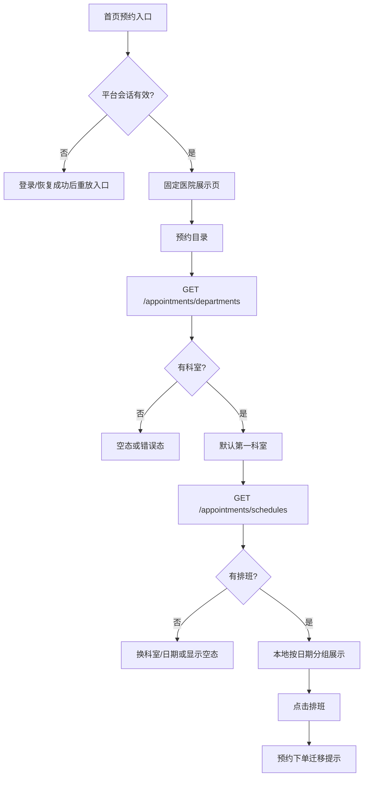

# 预约目录

当前实现是“固定医院展示页 → 科室目录 → 日期 → 排班”的只读浏览链路。预约下单、锁定号源、支付和成功回写尚未由当前页面实现；因此不能把“能看到排班”写成“已经可以预约”。

## 实际页面链路

| 顺序 | 用户动作/页面 | 实际结果 | 接口 |
| ---: | --- | --- | --- |
| 1 | 首页点击“预约挂号”或“互联网医院” | 先经过登录门禁，进入固定医院展示页 | `GET /me` 仅用于会话恢复 |
| 2 | 点击医院卡片“预约挂号” | 再次恢复/确认会话，进入预约目录 | 无医院列表接口 |
| 3 | 首次打开预约目录 | 读取科室，默认选第一个科室 | `GET /appointments/departments` |
| 4 | 选择科室 | 清空旧排班，读取该科室排班 | `GET /appointments/schedules` |
| 5 | 选择日期 | 本地切换当前日期分组 | 不重新请求 |
| 6 | 点击加载更多 | 扩大本地可见窗口 | 不等于服务端分页 |
| 7 | 点击排班卡片 | Toast：“预约下单功能迁移中” | 当前没有预约写入接口 |
| 8 | 点击路线 | 固定医院页显示路线未开放 | 没有路线接口 |

## 预约目录判断

接口：[[预约-目录与排班]]、[[认证门禁]]、[[预约-记录]]。

源码：[hospital-list.ts](../../../apps/miniprogram/src/pages/hospital-list/hospital-list.ts)、[appointment-directory.ts](../../../apps/miniprogram/src/pages/appointment-directory/appointment-directory.ts)。
