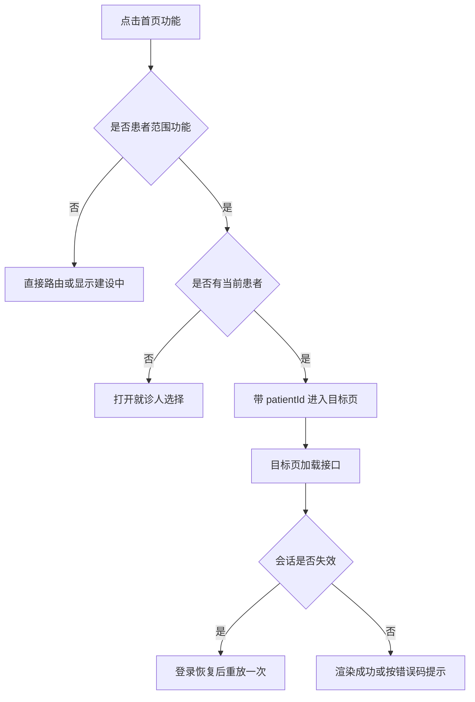

# 首页：功能地图

> 统计口径：按当前源码中的视觉点击位统计为 32 个。轮播图 3 个位置虽然视觉上有 3 个按钮，但都走 `follow` 同一逻辑；因此“视觉点击位”和“去重后的业务 action”不是同一个数量。

源码：[index.ts](../../../apps/miniprogram/src/pages/index/index.ts)。页面加载时先确保当前用户和患者数据，再根据状态渲染首页。

## 点击位总览

| 区域 | 数量 | 用户看到的功能 | 点击后 |
| --- | ---: | --- | --- |
| 当前就诊人卡片 | 2 | 二维码/绑定、切换就诊人 | [[首页-就诊人绑定|绑定或切换就诊人]] |
| 顶部快捷入口 | 4 | 预约挂号、门诊缴费、互联网医院、门诊病历 | 预约/缴费进入真实页面；互联网医院复用预约目录；病历显示迁移提示 |
| 宣传轮播图 | 3 | 关注公众号/服务入口 | [[首页-互联网医院|统一 follow 行为]] |
| 右侧快捷入口 | 3 | 智能导诊、就诊人、报告查询 | 前两项当前为建设中提示/患者选择；报告进入报告目录 |
| 服务分类栅格 | 15 | 3 组，每组 5 项 | 见下方服务表 |
| 悬浮导诊 | 1 | 智能导诊 | 当前实现为建设中提示/预留入口 |
| 底部导航 | 4 | 首页、服务、消息、我的 | 首页回顶；服务/消息迁移提示；我的进入个人中心 |
| **合计** | **32** |  |  |

## 首页功能表

| 功能 | 触发 | 下一步 | 接口/规则 | 状态 |
| --- | --- | --- | --- | --- |
| 当前就诊人卡片 | 点击卡片 | 选择或切换患者 | [[患者门禁|患者门禁]] | 实际可用 |
| 就诊人绑定 | 点击二维码/绑定 | 患者同步页 | [[首页-就诊人绑定|详情]] | 实际可用 |
| 预约挂号 | 点击顶部预约 | 医院/科室/排班 | [[首页-预约挂号|详情]] | 实际可用 |
| 门诊缴费 | 点击顶部缴费 | 门诊费用列表 | [[首页-门诊缴费|详情]] | 实际可用 |
| 互联网医院 | 点击顶部入口 | 复用预约目录 | [[首页-互联网医院|详情]] | 复用入口 |
| 门诊病历 | 点击顶部入口 | 迁移提示 | [[首页-门诊病历|详情]] | 迁移中 |
| 智能导诊 | 点击右侧/悬浮入口 | 建设中或迁移提示 | [[我的-底部导航与迁移|迁移状态]] | 建设中 |
| 就诊人快捷入口 | 点击右侧入口 | 就诊人选择 | [[首页-就诊人绑定|详情]] | 实际可用 |
| 报告查询 | 点击右侧入口 | 报告目录 | [[首页-报告查询|详情]] | 实际可用 |
| 我的挂号 | 点击门诊服务项 | 预约记录 | [[首页-我的挂号|详情]] | 实际可用 |
| 关注入口 | 点击轮播图 | 静态公众号说明页 | [[首页-互联网医院|详情]] | 实际可用 |
| 智能导诊 | 点击悬浮按钮 | 预留服务入口 | 无业务接口 | 建设中 |
| 门诊病历 | 服务栅格点击 | 迁移提示 | 无当前接口 | 迁移中 |
| 其他未实现服务 | 服务栅格点击 | “该服务正在建设中” | 无当前接口 | 建设中 |
| 服务/消息底部页 | 点击 tab | 迁移提示 | 无当前页面 | 迁移中 |

## 服务栅格 15 项的实际状态

| 服务分类 | 入口 | 当前动作 | 状态 |
| --- | --- | --- | --- |
| 门诊 | 我的挂号 | `appointment-records`，进入预约记录 | 实际可用 |
| 门诊 | 就诊人绑定 | `patient-select`，进入患者选择 | 实际可用 |
| 门诊 | 我的问诊 | 未配置 action，统一建设中 | 建设中 |
| 门诊 | 门诊病历 | 未配置 action，迁移提示 | 迁移中 |
| 门诊 | 电子导诊单 | 未配置 action，统一建设中 | 建设中 |
| 住院 | 住院信息查询、住院预缴、入院预问诊、出院随访、风险自评 | 未配置 action，统一建设中 | 建设中 |
| 便民 | 院内导航 | `hospital-navigation`，进入院内导航页 | 实际可用 |
| 便民 | 健康自测、健康百科、电子锦旗、表扬信 | 未配置 action，统一建设中 | 建设中 |

## 首页统一判断

相关详情：[[患者门禁|患者门禁]]、[[会话代际与旧响应|会话代际]]、[[小程序页面证据|小程序页面证据]]。
