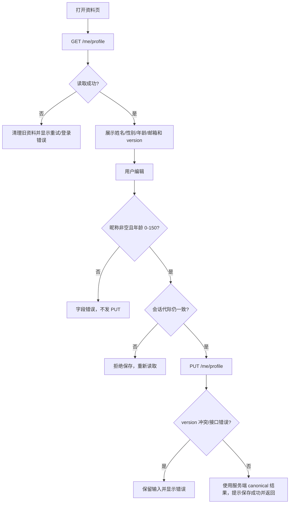

# 我的 · 个人资料

## 用户入口

在“我的”页点击头像、姓名或资料头部进入 `/pages/profile/profile`。这是当前账号资料，不是患者资料；页面不接受客户端 userId 作为权限边界。

## 读取和保存

## Contract

- 读取：`GET /api/v1/me/profile`。
- 更新：`PUT /api/v1/me/profile`，必填 `version`；可选 `displayName`、`gender`、`age`、`email`；未知字段拒绝。
- `gender` 只能是 `male`、`female`、`unknown`；`age` 为 `0–150` 或 `null`；显示名称不能为空。
- 页面保存前必须使用最近一次 GET 得到的 `version`，快速连点会被页面层拦截；服务端仍负责并发版本校验。
- 保存成功后以服务端返回的资料和版本为准，不用本地输入覆盖 canonical 快照。

接口：[[普通资料-读写]]、[[认证门禁]]。

源码：[profile.ts](../../../apps/miniprogram/src/pages/profile/profile.ts)。
