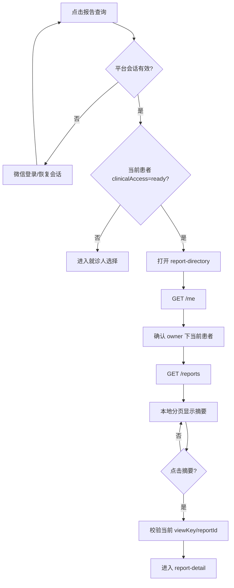

# 首页 · 报告查询

## 用户入口

首页右侧快捷入口的“报告查询”调用患者范围导航；未登录先登录，已登录但没有当前可用患者时先进入 [[就诊人选择]]。它不是首页后台静默查完后把旧列表带过去。

## 实际调用链

## 接口和参数

- 列表：`GET /api/v1/reports?patientId=<患者ID>&startDate=<YYYY-MM-DD>&endDate=<YYYY-MM-DD>&kind=<laboratory|imaging|ecg>`。
- `patientId`、`startDate`、`endDate` 必填；`kind` 可选。
- 列表返回报告摘要：`reportId`、`kind`、`title`、`reportedAt`、`status`、`hasAttachment`、`total`。
- 详情：`GET /api/v1/reports/:reportId?patientId=<患者ID>`；服务端同时校验当前用户、患者归属和短期报告引用。
- 当前详情 contract 只确认 `laboratory` 检验结果字段；列表里的影像/心电摘要不能推导出对应详情已完成。

## 页面判断

- 切换患者、登录账号变化或新一轮请求开始后，旧响应不能覆盖当前页面。
- 点击只接受当前可见列表里的 `viewKey`，防止旧 WXML 事件携带过期 `reportId`。
- “加载更多”是已经返回结果的本地展示窗口，不是接口分页证明。

接口：[[报告-目录与详情]]、[[报告短期引用]]、[[患者门禁]]。

源码：[index.ts](../../../apps/miniprogram/src/pages/index/index.ts)、[report-directory.ts](../../../apps/miniprogram/src/pages/report-directory/report-directory.ts)。
