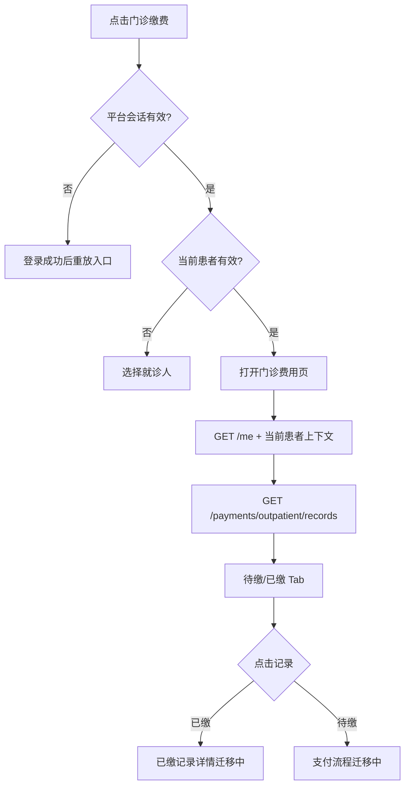

# 首页 · 门诊缴费

## 用户触发

首页顶部“门诊缴费”进入 `/pages/outpatient-payment/outpatient-payment`。这是患者范围功能：未登录先登录；没有当前可用患者先进入患者选择页。

## 页面逻辑

## 接口和显示规则

- 列表：`GET /api/v1/payments/outpatient/records?patientId=<患者ID>&status=<unpaid|paid>`。
- 返回字段包括 `recordId`、`status`、科室/医生、`billDate`、`amountFen`、`items`、`total`；金额由页面把分转换为展示金额。
- 页面 Tab 切换会重新请求对应状态，不把待缴结果复制为已缴。
- “加载更多”只展开本次完整响应的本地可见条数。
- 当前没有调用 `wx.requestPayment`、没有创建支付订单、没有提交支付结果；支付代码边界见 [[微信支付-代码边界]]。

## 失败判断

- 服务未配置：显示门诊缴费服务暂未配置。
- 当前患者没有缴费映射：清空旧费用卡片，显示明确空态，不能保留上一位患者金额。
- 会话/患者代际变化：重新执行 `/me → 患者 → 当前状态查询`，旧费用响应失去回写资格。

源码：[index.ts](../../../apps/miniprogram/src/pages/index/index.ts)、[outpatient-payment.ts](../../../apps/miniprogram/src/pages/outpatient-payment/outpatient-payment.ts)。
