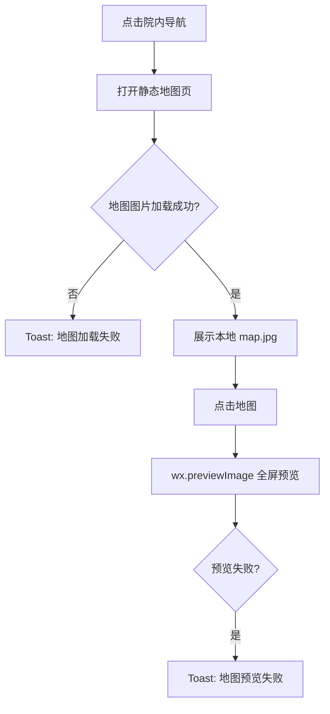

# 首页 · 院内导航

## 用户触发

首页“便民”服务栅格中的“院内导航”触发 `hospital-navigation`，直接打开 `/pages/hospital-navigation/hospital-navigation`。当前不要求患者上下文，也不请求后端。

## 实际逻辑

## 当前业务边界

- 地图文件是小程序本地资源 `/assets/hospital-navigation/map.jpg`。
- 没有楼栋/楼层切换、当前位置、科室搜索、路线规划、坐标或实时地图接口。
- “院内导航”当前应标记为静态迁移完成，不应描述为实时导航服务。

源码：[hospital-navigation.ts](../../../apps/miniprogram/src/pages/hospital-navigation/hospital-navigation.ts)。
