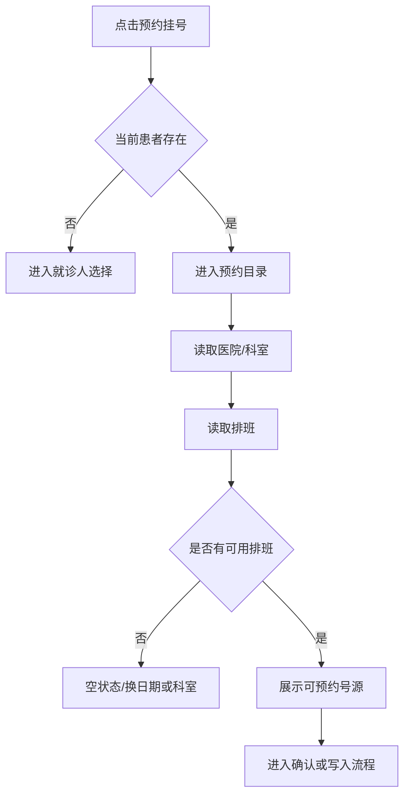

# 首页 · 预约挂号

## 用户触发

点击首页顶部“预约挂号”或右侧医院列表入口。

## 实际逻辑

## 接口链

- 目录：[[预约-目录与排班|预约目录与排班]]
- 记录：[[预约-记录|预约记录]]
- 公共前置：[[认证门禁|认证门禁]]、[[患者门禁|患者门禁]]

## 不能误读的地方

- `GET /appointments/departments`、`GET /appointments/schedules` 说明目录/排班读取链存在；它们不是预约写入成功的证明。
- 预约写入涉及供应商和支付/确认边界，具体以 [预约写入契约](../../appointment-write-contract-v1.md) 和运行时接口为准。

