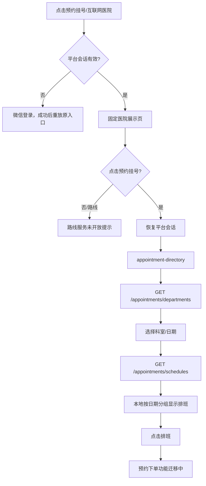

# 首页 · 预约挂号

## 用户触发

首页顶部“预约挂号”和顶部“互联网医院”当前都进入 `/pages/hospital-list/hospital-list`；它们不是两个独立的互联网医院业务。医院列表页只有一张固定的“高平市人民医院”卡片，点击后才进入预约目录。

## 实际逻辑

## 已有接口与尚未实现的接口

| 环节 | 当前事实 |
| --- | --- |
| 科室目录 | `GET /api/v1/appointments/departments`，已接入 |
| 排班目录 | `GET /api/v1/appointments/schedules?startDate&endDate&departmentId?&doctorId?`，已接入 |
| 号源展示 | 排班响应中的 `totalSlots`、`availableSlots` 等字段用于只读展示 |
| 预约写入 | 当前 `appointments` 模块没有 POST 预约路由；排班点击只显示迁移 Toast |
| 预约记录 | 另一个只读接口 `GET /api/v1/appointments/records`，见 [[预约-记录]] |
| 支付/确认 | 不能从预约目录推导出已经打通；支付模块是独立边界 |

## 不能误读的地方

- 旧文案中的“医院列表”不是动态机构 API；当前医院名称、地址和图片是页面配置。
- 当前页面没有锁号、下单、取消、支付、预约成功回写动作。
- `GET /appointments/schedules` 成功只表示读到了排班，不表示用户已经获得号源。

接口：[[预约-目录与排班]]、[[预约-记录]]、[[认证门禁]]。

源码：[index.ts](../../../apps/miniprogram/src/pages/index/index.ts)、[hospital-list.ts](../../../apps/miniprogram/src/pages/hospital-list/hospital-list.ts)、[appointment-directory.ts](../../../apps/miniprogram/src/pages/appointment-directory/appointment-directory.ts)。
