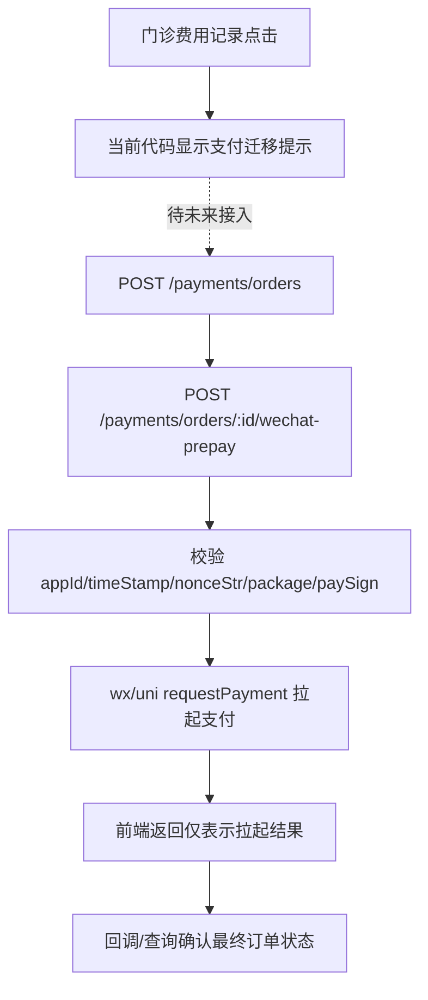

# 微信支付 · 代码边界

支付模块已定义订单、预下单和微信回调路由；当前小程序门诊费用页尚未把记录点击接到订单创建或 `wx.requestPayment`，所以本页描述“代码边界”，不宣称线上支付已验收。

## 服务端接口

完整路径均在 `/api/v1` 下：

| 方法 | 路径 | 身份/门禁 | 用途 |
| --- | --- | --- | --- |
| `POST` | `/payments/orders` | Bearer + `idempotency-key` + 支付开关 | 用 `patientId`、`quoteId` 创建订单 |
| `GET` | `/payments/orders/:orderId/wechat-prepay` | Bearer + `idempotency-key` + 支付开关 | 查询预下单状态 |
| `POST` | `/payments/orders/:orderId/wechat-prepay` | Bearer + `idempotency-key` + 支付开关 | 创建微信预支付并返回 pay params |
| `GET` | `/payments/orders/:orderId` | Bearer + 支付开关 | 读取安全订单视图 |
| `POST` | `/payments/wechat/notifications` | 微信支付服务商回调；无患者 Bearer | 接收回调，当前响应为成功/错误协议 |

订单创建 body 只有 `patientId` 和 `quoteId`；安全订单响应不向客户端暴露 owner、幂等键或 provider 内部字段。预支付参数包含 `appId`、`timeStamp`、`nonceStr`、`package`、`signType=RSA`、`paySign`。

## 小程序实际边界

`uni.requestPayment`/`wx.requestPayment` 负责拉起支付，不负责创建预支付订单；预下单接口返回成功也不等于支付成功或订单完成。

## 运行环境仍需验证

- 微信支付开关、商户配置、证书/密钥和回调网络路径。
- 回调验签、幂等写回、订单查询和前端重试的真实闭环。
- 自费、医保或混合支付是否由独立 quote/order 流程提供。

相关：[[支付状态机]]、[[门诊费用-记录]]。

源码：[payments/index.ts](../../../apps/api/src/modules/payments/index.ts)、[api-client.ts](../../../apps/miniprogram/src/services/api-client.ts)。
