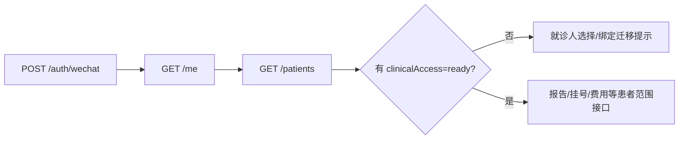

# 用户 · 当前用户

完整路径：`GET /api/v1/me`。这是页面进入阶段的 owner/session 读取接口，不负责选择患者、不返回患者列表，也不创建业务数据。

## 当前响应

服务端返回成功 envelope，`data.user.id` 是当前 principal 的用户 ID。前端用它确认当前会话代际和 owner，不应把这个 ID 当作患者 ID。

## 与其他接口的边界

- `/me` 成功只说明“当前用户已识别”。
- 患者范围接口仍需服务端按 principal 校验 `patientId`。
- session 失效时，前端会进入恢复、清理旧页面上下文并按需要重放入口。

证据：[api-client.ts](../../../apps/miniprogram/src/services/api-client.ts)、[auth/index.ts](../../../apps/api/src/modules/auth/index.ts)。
