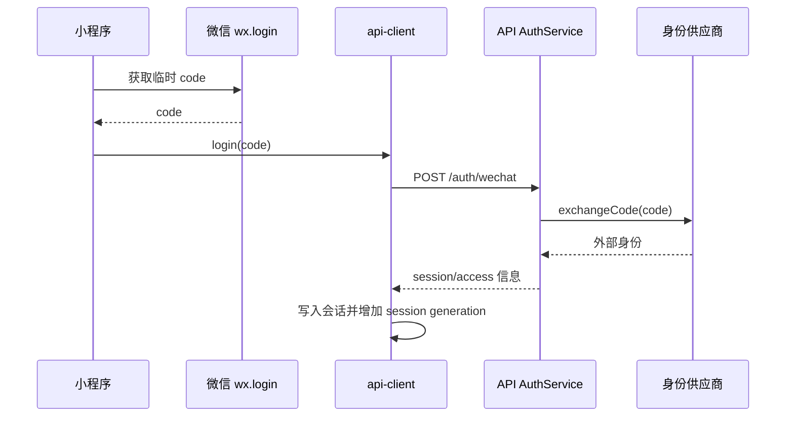

# 认证 · 微信登录

## 请求链

## 关键判断

- 没有 code、code 过期或供应商失败：不写入半成品会话。
- 新登录成功后，旧请求不能覆盖新会话，见 [[会话代际与旧响应|会话代际]]。
- 认证失败应返回登录动作，而不是把认证错误误报成患者为空。

证据：[api-client.ts](../../../apps/miniprogram/src/services/api-client.ts)、[auth module](../../../apps/api/src/modules/auth/index.ts)、[service.ts](../../../apps/api/src/modules/auth/service.ts)。
