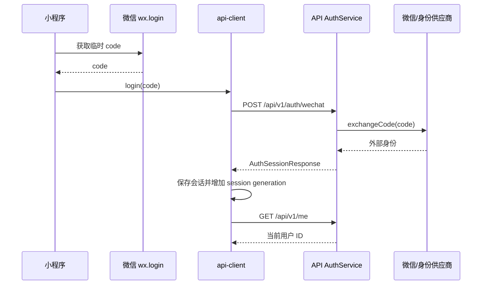

# 认证 · 微信登录

完整路径：`POST /api/v1/auth/wechat`。这是平台登录入口；认证解析器只把它作为匿名公共入口，其他需要当前用户的接口仍需 Bearer 会话。

## 请求链

## 请求和响应边界

- 请求 body 是 `WechatLoginRequest`，由微信临时 `code` 等 contract 字段组成；不能把患者 ID、支付字段混入登录请求。
- 成功返回 `AuthSessionResponse`；客户端保存会话后再读 `/me`，不会用登录响应直接假设患者存在。
- `/me` 成功只确认 owner，之后还要读 [[患者-列表]]。

## 失败判断

- 没有 code、code 过期或供应商失败：不写入半成品会话。
- 新登录成功后，旧请求不能覆盖新会话；见 [[会话代际与旧响应]]。
- 认证失败应返回登录恢复动作，而不是把认证错误误报成患者为空。

证据：[api-client.ts](../../../apps/miniprogram/src/services/api-client.ts)、[auth/index.ts](../../../apps/api/src/modules/auth/index.ts)、[service.ts](../../../apps/api/src/modules/auth/service.ts)。
