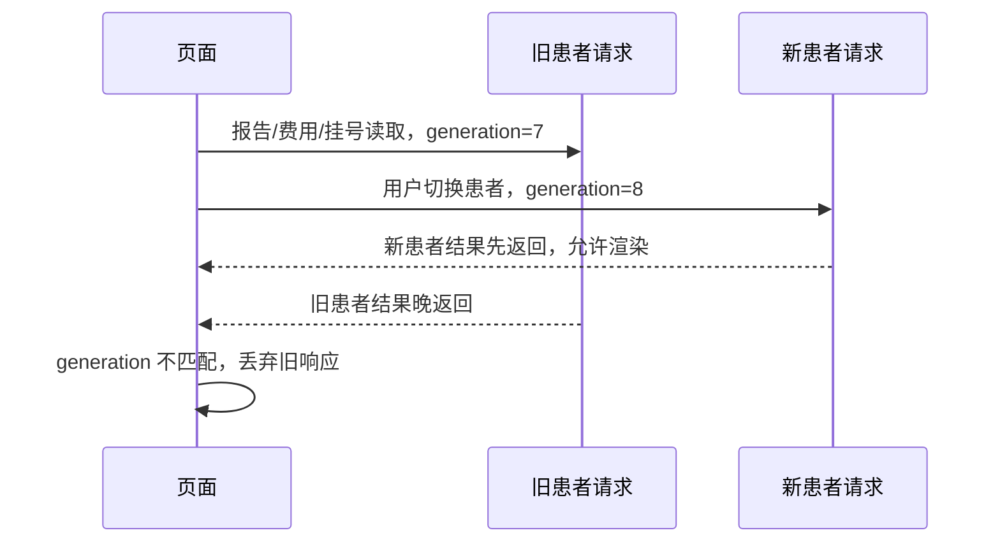

# 会话代际与旧响应

小程序请求层维护 session generation/代际。登录恢复、账号替换、退出或会话状态变化后，后续请求属于新代际；旧请求即使晚返回，也不能覆盖新会话、当前患者或页面状态。

## 典型竞态

## 处理规则

- 请求发出时记录 session generation、患者上下文和页面请求 token。
- 响应返回时同时比对当前 generation、当前 opaque patientId、请求守卫 token 和页面实例是否仍存活。
- 不匹配则丢弃旧响应，或重新读取当前 owner/patient，不写入当前页面状态。
- 页面级 single-flight 只共享同一远端请求；每个调用方仍要用自己的 token 判断是否可以回写。
- `onUnload` 会销毁页面实例守卫，防止页面离开后异步响应改写旧页面。

## 影响页面

首页患者同步、我的页面、就诊人选择、报告目录、预约记录、爽约记录和门诊费用都使用这类保护。它解释了为什么“接口已经返回”仍可能不更新页面：返回属于旧代际是安全丢弃，而不是失败。

源码：[api-client.ts](../../../apps/miniprogram/src/services/api-client.ts)、[session-generation.ts](../../../apps/miniprogram/src/services/session-generation.ts)、[session-boundary.ts](../../../apps/miniprogram/src/services/session-boundary.ts)、[page-instance-state.ts](../../../apps/miniprogram/src/services/page-instance-state.ts)。
