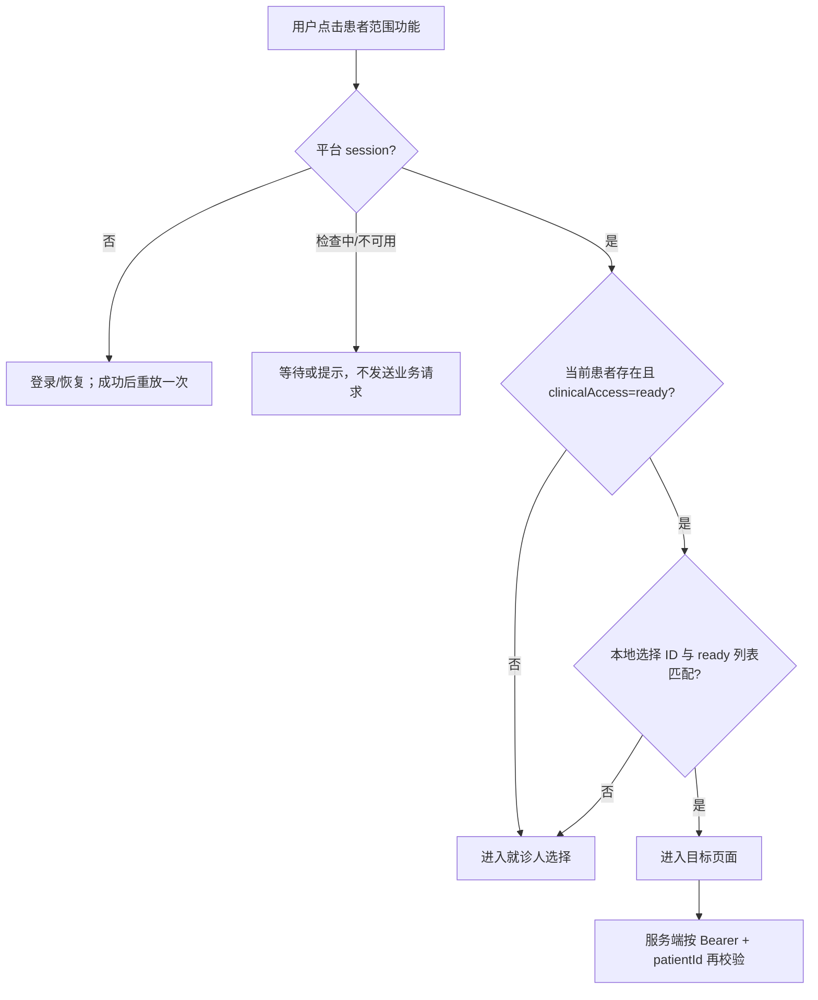

# 患者门禁

患者门禁回答一个核心问题：当前操作到底属于哪个就诊人。前端门禁用于阻止用户进入后才收到 401，服务端仍必须再次校验 owner 和 patient 归属。

## 两种入口判断

| 函数/场景 | 条件 | 结果 |
| --- | --- | --- |
| `resolveAuthenticatedEntry` | session `open` | 允许进入认证范围页面 |
| `resolveAuthenticatedEntry` | `invalid` | Toast“请先登录”，回首页/登录恢复 |
| `resolveAuthenticatedEntry` | `checking`/`unavailable` | 等待或提示“登录状态验证中/暂不可用” |
| `resolvePatientScopedEntry` | 无有效 session | 登录门禁 |
| `resolvePatientScopedEntry` | 无 `clinicalAccess=ready` 患者 | 进入就诊人选择 |
| `resolvePatientScopedEntry` | 有 ready 患者且与本地 opaque ID 一致 | 打开目标患者页 |

## 判断顺序

## 适用范围

预约记录、报告、门诊费用、爽约记录等患者范围功能需要门禁；固定医院展示、公众号说明、院内静态地图、建设中 Toast 不需要患者门禁。

## 禁止的行为

- 患者为空时不发送空 `patientId`。
- `clinicalAccess=unavailable` 不能被选作当前患者。
- 不能因为 URL/事件里带有 patientId 就跳过当前用户患者列表校验。
- 患者切换后，旧页面快照和旧请求必须失去回写资格。

源码：[patient-navigation.ts](../../../apps/miniprogram/src/services/patient-navigation.ts)、[patient-select.ts](../../../apps/miniprogram/src/pages/patient-select/patient-select.ts)。
