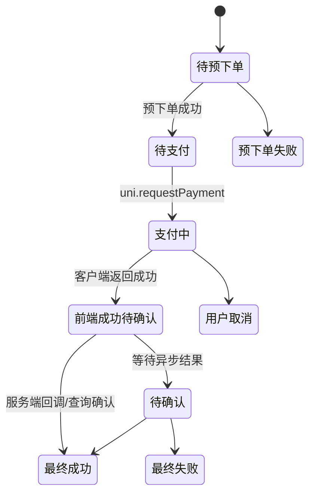

# 支付状态机

当前仓库能确认前端预下单和支付拉起边界，但真实支付成功、回调验签、订单写回仍需运行环境验证。

```mermaid
stateDiagram-v2
    [*] --> 待预下单
    待预下单 --> 待支付: 预下单成功
    待预下单 --> 预下单失败
    待支付 --> 支付中: uni.requestPayment
    支付中 --> 前端成功待确认: 客户端返回成功
    支付中 --> 用户取消
    前端成功待确认 --> 最终成功: 服务端回调/查询确认
    前端成功待确认 --> 待确认: 等待异步结果
    待确认 --> 最终成功
    待确认 --> 最终失败
```

“支付 API 返回成功”不能直接等同于订单已最终结算；需要结合服务端回调和订单查询规则确认。

