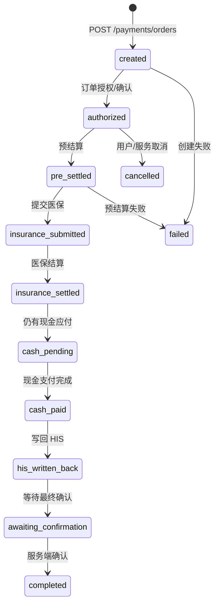

# 支付状态机

本仓库能确认支付模块的订单状态和预下单/回调接口边界；不能仅凭静态代码证明当前环境已完成商户配置、回调可达和真实支付验收。

## 当前订单状态

服务端订单状态包括：

`created` → `authorized` → `pre_settled` → `insurance_submitted` → `insurance_settled` → `cash_pending` → `cash_paid` → `his_written_back` → `awaiting_confirmation` → `completed`。

另外存在 `failed`、`cancelled` 等终态/异常状态；具体可转移关系要以订单服务实现和支付 provider contract 为准，不能用前端 Toast 推断。

## 预下单和支付拉起

微信预支付只是另一条外部支付动作：

1. 客户端创建/获取订单预支付信息。
2. 服务端生成 `appId`、`timeStamp`、`nonceStr`、`package`、`paySign`。
3. 客户端校验参数后调用 `wx/uni.requestPayment`。
4. 客户端成功回调只代表拉起/支付交互返回，不能直接把订单标为 `completed`。
5. 服务端依赖微信回调或受控查询完成最终状态写回和后续业务确认。

## 当前小程序实际状态

门诊费用页的记录点击仍显示“支付流程正在迁移中”，没有调用订单创建、预下单或 requestPayment。支付状态机文档描述的是后端契约，不是当前 UI 已经打通的证明。

相关：[[微信支付-代码边界]]、[[门诊费用-记录]]。

源码：[payments/index.ts](../../../apps/api/src/modules/payments/index.ts)、[api-client.ts](../../../apps/miniprogram/src/services/api-client.ts)。
