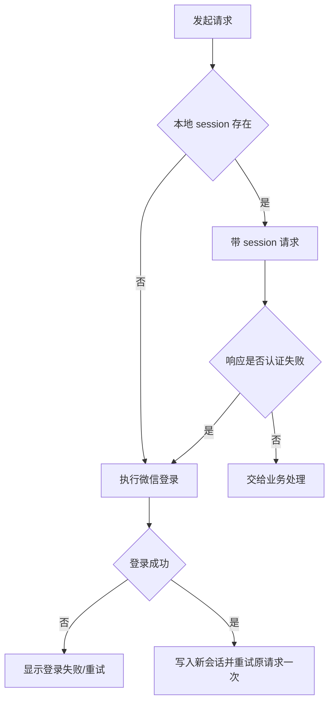

# 认证门禁

## 统一规则

## 禁止的行为

- 不把未登录当成空患者。
- 不无限重放请求。
- 不用旧 session 的迟到响应覆盖新 session。
- 不把客户端保存的患者 ID 当作服务端授权证明。

源码：[api-client.ts](../../../apps/miniprogram/src/services/api-client.ts)、[auth service](../../../apps/api/src/modules/auth/service.ts)。
