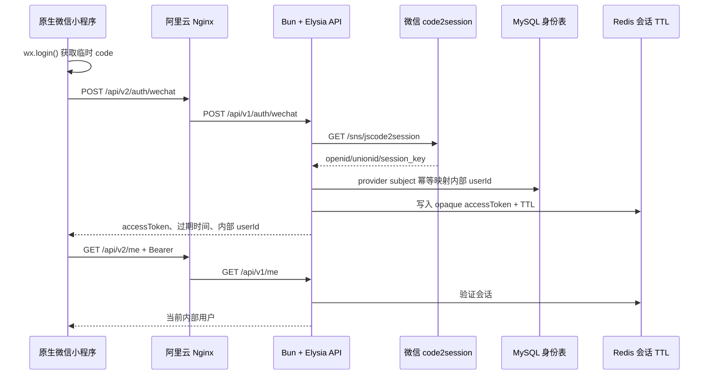

# 微信授权登录实施与验收手册

> 当前候选：服务端 release `5a31427`；小程序运行包来源 `7a6f4df34fac5975c6012a30d2c137953a892059`（提交 `7a6f4df`）。

本文是微信小程序登录的唯一维护入口。新会话开始处理登录、会话、患者绑定或线上排障时，先阅读本文和
[`docs/logging.md`](logging.md)，不要重新猜测旧服务的接口、微信 provider 地址或服务器端口。

## 当前结论

当前线上新 API release 为 `5a31427`，旧 Python `8001` 保持共存；生产切换和运行边界见
[`release/5a31427-production-acceptance-2026-08-21.md`](release/5a31427-production-acceptance-2026-08-21.md)。
该 release 切换只补齐新服务的只读 Provider trace 与日志证据，不改变微信登录的业务开放边界。

当前本地小程序候选为 `7a6f4df`，运行包来源指纹为
`7a6f4df34fac5975c6012a30d2c137953a892059`，尚未上传线上。本候选包含运行包 test/spec 文件边界，
并保留认证命令会话代际边界，
就诊人选择会话代际边界，不改变微信登录与 `/me`
响应边界见 [`release/miniprogram-auth-session-response-contract-2026-08-19.md`](release/miniprogram-auth-session-response-contract-2026-08-19.md)。
命令请求禁止跨会话自动重放的边界见
[`release/miniprogram-command-session-replay-boundary-2026-08-19.md`](release/miniprogram-command-session-replay-boundary-2026-08-19.md)。

2026-08-20 真机登录与患者同步的最新低敏证据和未完成页面边界见
[`release/miniprogram-real-device-login-acceptance-2026-08-20.md`](release/miniprogram-real-device-login-acceptance-2026-08-20.md)。

微信授权登录的代码闭环已经完成：

1. 小程序调用 `wx.login()` 获取一次性 `code`。
2. 小程序只把 `code` 发送到 Hospital API。
3. API 服务端调用微信 `code2session`，得到 provider 身份。
4. API 通过 MySQL `hp_identity_users` 幂等创建或读取内部用户。
5. API 通过 Redis 写入带 TTL 的平台会话，并只返回平台 `accessToken`。
6. 小程序使用 Bearer 会话访问 `/me` 和其他需要认证的接口。

登录结果在两个边界上校验：微信 adapter 先过滤原始 `code2session` 响应，`AuthService` 在写入
`hp_identity_users` 前再次校验并只投影 `providerSubject`、可选 `unionId` 和低敏 trace。异常结果不会写入
身份表，也不会签发 Redis 会话；失败日志只记录固定 `resultViolation`，不记录 openid、unionid、session_key、
临时 code 或 provider 原文。

小程序接收成功 JSON 后还有第三道客户端边界：`requireAuthSessionResponse` 完整校验登录包络、Bearer 类型、过期时间、
有界 token 和内部 user id，只有通过后才写入本地会话；`requireCurrentUserResponse` 只接受 `/me` 返回的安全 owner 引用，
并丢弃未知字段。这里使用 `request<unknown>`，不是把 TypeScript 泛型当作运行时校验；协议异常统一返回
`provider-response-invalid`，不会被降级成“登录成功”或空用户。登录专属修正的历史本地证据为 `c727e1c`、152 项测试；当前候选
全量小程序测试为 177 项通过、1403 个断言，整体已推进到 `7a6f4df`，完整运行包来源为
`7a6f4df34fac5975c6012a30d2c137953a892059`，登录后患者初始化边界见
[`release/miniprogram-login-patient-bootstrap-boundary-2026-08-19.md`](release/miniprogram-login-patient-bootstrap-boundary-2026-08-19.md)，列表读取边界见
[`release/miniprogram-list-response-envelope-contract-2026-08-19.md`](release/miniprogram-list-response-envelope-contract-2026-08-19.md)。

身份仓储返回值还有独立的持久化读模型校验：登录必须确认仓储返回的 `providerSubject` 仍对应本次微信交换，
并且只有有界的内部 `userId` 才能创建 Redis 会话。患者同步和预支付读取身份时还会确认 `userId` 等于当前
Bearer owner；发现脏数据或替换仓储越界时返回 `persistence-invalid`，不会继续访问 Provider 或创建支付尝试。

代码和测试完成不等于真实微信登录已经上线。真实登录还必须同时满足：微信 AppID/AppSecret、MySQL 目标 schema、
Redis 会话、微信合法域名、HTTPS 证书和开发者工具/真机验收全部通过。

### 历史 release `c26e696` 记录（截至 2026-08-18 22:57 CST，非当前线上基线）

截至 2026-08-18 22:57 CST，当时线上 API release 为 `c26e696`，并已应用
`0016_patient_directory_sync_owner_index`。该版本已经完成生产 env preflight、原子切换、MySQL/Redis/schema 探针、公网
`/api/v2` 健康检查、ready 连续检查、未登录认证边界和旧 Python 服务共存验收；本次只补齐普通资料更新日志链路，
切换后 runtime smoke 和低敏认证/患者目录观察已通过，但仍不能把服务端日志当作真机页面证据。当时配套小程序运行包来源指纹为
`d2086d819b3e393da2e8c5c39d7704012854214b`；当时客户端候选 commit 为 `d2086d8`，完整服务端发布边界见
[`release/c26e696-production-acceptance-2026-08-18.md`](release/c26e696-production-acceptance-2026-08-18.md)，
小程序候选和新旧真机调试边界见
[`release/miniprogram-readonly-acceptance-candidate-2026-08-18.md`](release/miniprogram-readonly-acceptance-candidate-2026-08-18.md)
和 [`release/miniprogram-device-session-boundary-2026-08-18.md`](release/miniprogram-device-session-boundary-2026-08-18.md)。
该历史窗口的业务未完成项不能覆盖本文顶部的当前基线；后续以 [`roadmap-next-phase.md`](roadmap-next-phase.md) 最新检查点执行。

### 历史 release 切换后的业务边界（2026-08-18）

当时 release `c26e696` 包含微信身份边界收紧、患者目录空快照和报告/门诊费用空 Provider 患者引用的 fail-closed 保护：已有 HIS 就诊人时，外部目录“完成但为空”会返回
`patient-directory-snapshot-unsafe`，不会静默停用旧患者。切换后运行时 smoke 已通过，但真实微信登录和患者同步必须重新在当前 release 上取证；不能把切换前 `5c4e7cf` 的单患者成功日志直接复用。候选代码和生产切换证据分别见
[`release/candidate-3ab0a6c-preproduction-smoke-2026-08-17.md`](release/candidate-3ab0a6c-preproduction-smoke-2026-08-17.md) 和
 [`release/3ab0a6c-production-acceptance-2026-08-17.md`](release/3ab0a6c-production-acceptance-2026-08-17.md)。当时 `c26e696` 的发布和业务边界见
[`release/c26e696-production-acceptance-2026-08-18.md`](release/c26e696-production-acceptance-2026-08-18.md)。

### 当前开发者工具观测（2026-08-16）

本次真机调试曾观测到 `POST /api/v2/auth/wechat` 返回 `503`，同一开发者工具窗口的
旧页面层仍出现过已脱敏的就诊人卡片。该卡片可能来自之前已加载的页面实例或本地派生状态，
不能据此推导本次微信授权成功；在没有同一链路的 `auth.wechat.login.succeeded`、`GET /me` 和
患者同步证据前，本次登录仍标记为“未完成真实验收”。

为避免旧状态误导后续业务，首页现在遵循以下收敛规则：

- 会话恢复失败时清空当前页面的患者派生数据，不删除仍可能可重试的本地 token；
- `401` 清除 token 后重新兑换微信 code 仍失败时，清空患者上下文并保持登录失败态；
- Redis/网络暂时故障但 token 尚未被判失效时，不伪造登录成功，也不在客户端盲目删除 token；
- 只有重新获得当前 principal、完成患者目录读取/同步后，才允许把患者上下文交给预约、报告或费用页面。

这组规则已经加入原生小程序 acceptance 测试；它解决的是页面状态一致性，不等价于微信 provider、
MySQL、Redis 或公网域名的真实可用性。线上验收仍必须按本文件的“真机验收”清单逐项保存请求号、
服务端事件和 Redis TTL 证据。

### 服务器真实链路证据（2026-08-16）

此前 `a11f117` 生产进程已取得一组真实账号的服务端链路证据：23:08:55 的一次登录因
`PersistenceUnavailableError` 返回 503；23:09:08 下一次登录出现
`auth.wechat.login.succeeded` 并返回 200，随后 `/patients` 返回 200，完整患者同步返回 200，
服务端记录 1 条 active 患者和 1 条 `his-patient` 映射。23:17 又通过 `/me` 完成会话恢复并重复同步成功。

随后历史版本 `41c9c18` 已完成生产切换，预约科室/排班真实只读请求返回 200，排班快照出现
`snapshotPersistenceStatus=persisted`；这只证明当时 release 的预约只读与快照观察事实可用，
不代表 `bab0ce2` 的患者切换、预约写入、支付或真机完整验收通过。该历史发布与预约证据见
[`release/41c9c18-production-acceptance-2026-08-16.md`](release/41c9c18-production-acceptance-2026-08-16.md)。

因此当前状态应准确表述为“服务端真实微信登录与单患者目录同步部分验收通过”，而不是“全部真机业务已完成”。
本次仍缺 Redis 实际 TTL 读取证据、多就诊人切换、预约/报告/门诊费用 Provider 结果和完整真机页面网络对齐。
requestId、traceId 和低敏事件明细见
[`release/wechat-patient-sync-production-acceptance-2026-08-16.md`](release/wechat-patient-sync-production-acceptance-2026-08-16.md)。

### `wx.login` 与用户资料授权不是一回事

`wx.login()` 是静默获取一次性登录 `code` 的接口，本身不会弹出“获取头像/昵称”的用户资料授权框。新小程序只用
`code` 在服务端兑换平台身份，不主动索取与登录和医疗服务无关的头像、昵称，因此登录成功后首页会显示“微信已登录”，
没有绑定就诊人时仍显示匿名就诊人卡片。

登录后的就诊人交互与旧端保持同一业务语义：首页可以默认展示目录第一位患者，但顶部“更换就诊人”必须进入
独立选择页，而不是在首页用临时弹窗替代。选择页只读取平台的脱敏患者目录，选择结果仅在本地保存服务端返回的
opaque `patientId`；返回首页时重新匹配当前目录，报告和挂号记录会清空并按新患者重新查询。当前新服务没有真实的新增/绑定患者
写入接口，因此页面明确提示该能力待接入，不把“刷新目录”误显示为“绑定成功”。

如果未来产品确实需要头像或昵称，必须单独设计用户主动触发的资料授权流程、隐私说明、服务端字段和撤回策略，不能把
`wx.getUserProfile` 混入身份登录接口，也不能把资料当作患者身份或就诊人绑定依据。

## 线上路由

当前新服务与旧服务共存：

| 层级 | 地址 | 说明 |
| --- | --- | --- |
| 旧服务 | `test-hp.meiyi.pro/*` | 继续代理内网 `0.0.0.0:8001`，不得改动登录链路 |
| 新服务健康检查 | `test-hp.meiyi.pro/api/v2/health/live` | 阿里云 Nginx 精确路由到 `10.0.0.3:18081/health/live` |
| 新服务 API | `test-hp.meiyi.pro/api/v2/*` | Nginx 映射到新 Elysia 的 `/api/v1/*` |
| 新服务进程 | `10.0.0.3:18081` | 内网服务器 WireGuard 地址，仅由 v2 systemd 管理 |

新小程序的 `apiBaseUrl` 是域名，`apiPrefix` 是 `/api/v2`。小程序代码中的业务路径不再重复写 `/api/v1`，由
客户端前缀和 Nginx 路由共同完成版本隔离。

2026-08-17 已将 `bab0ce2` 原子切换到新 API，公网 `/api/v2` 的 live/ready（含
`Cache-Control: no-store`）、system-ping、未登录认证边界和旧服务共存已通过；这只证明平台运行时
与路由正确，真实微信 `wx.login()`、Redis TTL、`/me`、患者同步和真机业务仍必须按下文单独验收。
旧版本 `d177991` 的切换证据仅作为历史记录保留，当前发布证据见
[`release/bab0ce2-production-acceptance-2026-08-17.md`](release/bab0ce2-production-acceptance-2026-08-17.md)。



## API 契约

### 登录

```http
POST /api/v2/auth/wechat
Content-Type: application/json
X-Request-Id: mp-...

{"code":"wx.login 返回的一次性 code"}
```

`code` 是一次性不透明凭证，服务端只接受非空、长度不超过 256 个 Unicode 字符、无首尾空白且不含控制字符的值。
登录请求也不接受 `openid`、`unionid`、`session_key` 或其它未声明字段；这类输入在进入微信依赖前统一返回
`400 validation`，不会被静默清洗后伪装成登录成功。API service 和微信 adapter 都保留同一条运行时门禁，避免
Worker、回放任务或未来内部调用绕过 HTTP schema 后产生不同语义。

成功响应只允许包含：

```json
{
  "success": true,
  "data": {
    "accessToken": "opaque-platform-token",
    "tokenType": "Bearer",
    "expiresInSeconds": 3600,
    "user": { "id": "internal-user-id" }
  }
}
```

禁止小程序提交或接收：`openid`、`unionid`、`session_key`、AppSecret、微信商户凭据和 provider 原始报文。

### 会话恢复

```http
GET /api/v2/me
Authorization: Bearer <accessToken>
```

服务端从 Redis 验证 token；小程序不得解析 token、猜测用户身份或把本地 token 当作永久登录证明。小程序进程内的
并发会话恢复共享同一个 `wx.login()` 请求，避免首页、患者同步和业务页面同时消耗多个一次性 code。收到 401 后，
只有幂等的受保护 `GET` 读取最多重新执行一次 `wx.login()`；如果其他并发请求已经换得新 token，旧 GET 请求只能
复用新 token，不能把它清除，不能无限重试。资料 `PUT`、患者同步 `POST`、支付预支付和其他命令收到 401 后不自动
重放原请求，必须由页面在当前账号确认后重新发起，避免旧请求体或幂等键跨账号执行。

服务端在调用 Redis 前还会校验 Bearer token 的传输边界：token 必须是非空、首尾无空白、无控制字符且不超过
512 个字符。越界或畸形 token 直接返回 `401 unauthorized`，不会触发 Redis 查询，也不会把 Authorization 原值
写入日志；这只是凭证形状门禁，不能替代 Redis 中的 owner、存在性和 TTL 校验。

### 健康检查

```http
GET /api/v2/health/live
GET /api/v2/health/ready
```

`live=ok` 只证明 API 进程响应；`ready=not_ready` 可能表示数据库、Redis 或 schema 尚未完成，不代表代码崩溃。
两个健康接口均使用 `Cache-Control: no-store`，避免 Nginx、CDN 或中间缓存把过期的 readiness 状态用于发布判断。

## 服务端环境变量

环境文件只通过 SSH 写入；推荐以仓库内 [`infra/systemd/api.env.example`](../infra/systemd/api.env.example)
作为字段和中文注释模板，不把真实值写回仓库：

```text
/home/ps/code/hospital-platform/shared/api.env
```

权限必须是 `0600`，目录必须是 `0700`，不得提交 Git、写入部署包或打印到日志。生产登录至少需要：

```dotenv
NODE_ENV=production
HOST=10.0.0.3
PORT=18081
LOG_LEVEL=info
DOCS_ENABLED=false
CORS_ORIGINS=https://test-hp.meiyi.pro

WECHAT_IDENTITY_READY=true
WECHAT_APPID=<微信小程序 AppID>
WECHAT_APP_SECRET=<微信小程序 AppSecret>
WECHAT_IDENTITY_BASE_URL=https://api.weixin.qq.com

DATABASE_URL=<新平台目标数据库连接串>
REDIS_URL=<新平台 Redis 连接串>
PERSISTENCE_SCHEMA_READY=true
```

`PERSISTENCE_SCHEMA_READY=true` 只能在目标 schema 完成 staging 验证、生产 migration 已受控执行并且只读 probe 返回
`ok` 后设置。API 不会自动执行 migration，也不能把旧项目数据库连接串直接复制过来作为“快速登录”方案。

## 微信公众平台配置

在与 `WECHAT_APPID` 对应的小程序后台确认：

1. `request 合法域名` 包含 `https://test-hp.meiyi.pro`。
2. 域名证书完整、有效，微信开发者工具和真机都能通过 HTTPS 访问。
3. AppID 与服务端配置一致；AppSecret 只存在服务器 env，不进入小程序代码。
4. 小程序网络请求中只出现 Hospital API 域名，不出现 `api.weixin.qq.com`。
5. 如果更换域名、证书或阿里云转发，必须重新做真机登录验收。

## 启用顺序

### 1. 本地代码验收

```powershell
pnpm check
```

必须包含：架构审计、Biome、类型检查、API/adapter/persistence/miniprogram 测试和生产构建。

### 2. staging 数据库验收

使用独立数据库和独立 Redis，不触碰旧服务数据库：

```powershell
$env:DATABASE_URL = "mysql://<user>:<password>@<staging-host>/<database>"
$env:REDIS_URL = "redis://<staging-host>:6379"
pnpm db:migrate
pnpm db:schema
pnpm db:integration
```

迁移和集成验收通过后，保存 migration、schema probe、Redis TTL 和登录接口的证据。

### 3. 线上 env 传输与服务重启

只替换新服务的 env，不修改旧服务的 env：

```bash
chmod 700 /home/ps/code/hospital-platform/shared
chmod 600 /home/ps/code/hospital-platform/shared/api.env
sudo systemd-analyze verify /etc/systemd/system/hospital-platform-api-v2.service
sudo systemctl daemon-reload
sudo systemctl restart hospital-platform-api-v2.service
```

重启后先看启动日志中的以下字段：

- `runtimeMode=production`
- `authRuntimeStatus=ready`
- `authIdentityGateway=injected`
- `authSessionStore=injected`
- `persistenceRepositories=enabled`
- `persistenceSchemaProbe=ok`

任意一项不是预期值，都不能继续真机登录。

### 4. 真机验收

必须同时保存以下证据：

- 微信开发者工具或真机的 `wx.login()` 成功记录；
- `POST /api/v2/auth/wechat` 的响应状态和 `x-request-id`；
- 服务端 `auth.wechat.login.requested/succeeded` 日志；
- `GET /api/v2/me` 返回当前内部 userId；
- Redis 中 token TTL 存在，且过期后返回 401；
- 日志和小程序网络列表中没有 `code`、openid、unionId、session_key、AppSecret 或 accessToken。

## 日志排障

生产日志由 `hospital-api-v2.service` 写入 journald：

```bash
sudo journalctl -u hospital-platform-api-v2.service -n 200 --no-pager
sudo journalctl -u hospital-platform-api-v2.service --since "10 minutes ago" --no-pager \
  | rg 'auth\.wechat\.login|http\.request\.(completed|failed)'
```

一次登录应能按同一 `traceId/requestId` 看到：

1. `http.request.completed` 或 `http.request.failed`；
2. `auth.wechat.login.requested`；
3. `auth.wechat.login.succeeded` 或 `auth.wechat.login.failed`。

允许记录：`traceId`、`requestId`、`providerRequestId`、内部 `userId`、TTL、错误类型和 retryable 分类。
禁止记录：临时 code、openid、unionId、session_key、accessToken、Authorization、provider message 和原始响应。

常见错误判断：

| 现象 | 结论 | 处理 |
| --- | --- | --- |
| `dependency-not-configured` | provider、MySQL、schema 或 Redis gate 未打开 | 看启动日志，不要重试真机 |
| `provider-request-rejected` | code 无效、过期或微信拒绝 | 重新触发 `wx.login`，核对 AppID/域名 |
| `provider-temporarily-unavailable` | 微信接口超时、限流或 5xx | 使用 requestId 排查，按 retryable 处理 |
| `unauthorized` | Redis 中 token 不存在或已过期 | 重新登录，检查 Redis TTL 和实例连通性 |
| 登录成功但 `/me` 401 | token 没有保存、域名/前缀错误或 Redis 不同实例 | 对比小程序 `apiBaseUrl/apiPrefix`、requestId 和 Redis 配置 |
| `/api/v2/...` 返回 404 | 开发者工具使用旧缓存前缀、旧构建产物或公网 v2 路由未加载 | 重新构建小程序，确认请求地址只有一个 `/api/v2`，再检查 Nginx 精确路由 |
| 首页图片 404 或 WXSS 本地资源报错 | 构建产物未复制 `assets`，或把本地图片写进 WXSS `url()` | 使用 `pnpm --filter @hospital/miniprogram build`，并在 WXML 使用 `<image>` 加载本地图片 |

## 回滚

登录切片异常时只回滚新服务，不动旧服务：

1. 停止 `hospital-platform-api-v2.service`。
2. 从 `/etc/nginx/conf.d/test-hp.meiyi.pro.conf.bak-<时间标识>` 恢复新路由前的 Nginx 配置。
3. 执行 `nginx -t` 后再平滑 reload。
4. 确认旧 `8001` 进程和原域名根路径仍然正常。

不要删除旧 release、旧 systemd 备份或旧服务进程；先保留证据，再决定是否修复或回滚。

## 代码入口

| 文件 | 责任 |
| --- | --- |
| `apps/api/src/modules/auth/index.ts` | Elysia 登录和会话恢复路由 |
| `apps/api/src/modules/auth/service.ts` | code2session、内部用户映射、Redis 会话编排和登录日志 |
| `packages/adapters/src/wechat-identity.ts` | 微信 code2session HTTP adapter |
| `packages/persistence/src/mysql-repositories.ts` | `hp_identity_users` 幂等身份仓储 |
| `packages/persistence/src/redis-session.ts` | Bearer token TTL 存储 |
| `apps/miniprogram/src/types.ts` | 小程序 API、会话、就诊人、预约、报告和支付类型 |
| `apps/miniprogram/src/services/api-client.ts` | wx.login、版本前缀、token 保存和 requestId |
| `apps/miniprogram/src/services/session-service.ts` | 会话恢复和登录状态 |
| `apps/miniprogram/project.config.json` | 指定构建后的 `dist/` 为小程序运行根目录，并保留 TypeScript 编译插件配置 |
| `apps/miniprogram/scripts/build.ts` | 编译 TypeScript 页面、复制静态资源并验证真实 `.js` 页面文件 |
| `infra/systemd/hospital-platform-api-v2.service` | 新 API 进程启动边界 |
| `infra/nginx/test-hp.meiyi.pro.conf.example` | 公网 v2 隔离路由模板 |
