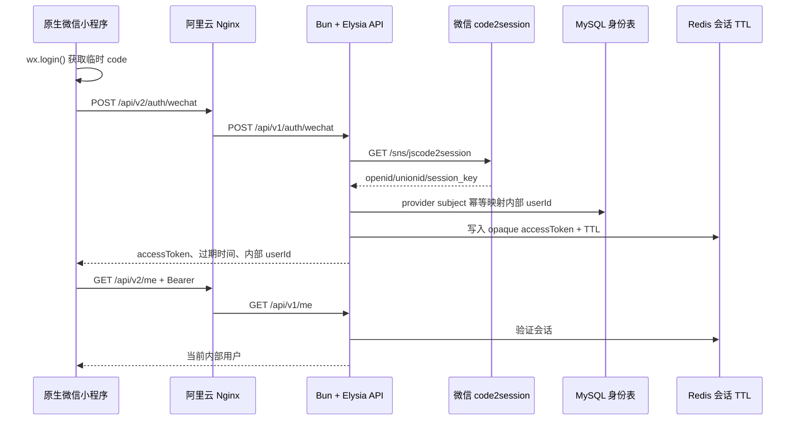

# 微信授权登录实施与验收手册

本文是微信小程序登录的唯一维护入口。新会话开始处理登录、会话、患者绑定或线上排障时，先阅读本文和
[`docs/logging.md`](logging.md)，不要重新猜测旧服务的接口、微信 provider 地址或服务器端口。

## 当前结论

微信授权登录的代码闭环已经完成：

1. 小程序调用 `wx.login()` 获取一次性 `code`。
2. 小程序只把 `code` 发送到 Hospital API。
3. API 服务端调用微信 `code2session`，得到 provider 身份。
4. API 通过 MySQL `hp_identity_users` 幂等创建或读取内部用户。
5. API 通过 Redis 写入带 TTL 的平台会话，并只返回平台 `accessToken`。
6. 小程序使用 Bearer 会话访问 `/me` 和其他需要认证的接口。

代码和测试完成不等于真实微信登录已经上线。真实登录还必须同时满足：微信 AppID/AppSecret、MySQL 目标 schema、
Redis 会话、微信合法域名、HTTPS 证书和开发者工具/真机验收全部通过。

## 线上路由

当前新服务与旧服务共存：

| 层级 | 地址 | 说明 |
| --- | --- | --- |
| 旧服务 | `test-hp.meiyi.pro/*` | 继续代理内网 `0.0.0.0:8001`，不得改动登录链路 |
| 新服务健康检查 | `test-hp.meiyi.pro/api/v2/health/live` | 阿里云 Nginx 精确路由到 `10.0.0.3:18081/health/live` |
| 新服务 API | `test-hp.meiyi.pro/api/v2/*` | Nginx 映射到新 Elysia 的 `/api/v1/*` |
| 新服务进程 | `10.0.0.3:18081` | 内网服务器 WireGuard 地址，仅由 v2 systemd 管理 |

新小程序的 `apiBaseUrl` 是域名，`apiPrefix` 是 `/api/v2`。小程序代码中的业务路径不再重复写 `/api/v1`，由
客户端前缀和 Nginx 路由共同完成版本隔离。



## API 契约

### 登录

```http
POST /api/v2/auth/wechat
Content-Type: application/json
X-Request-Id: mp-...

{"code":"wx.login 返回的一次性 code"}
```

成功响应只允许包含：

```json
{
  "success": true,
  "data": {
    "accessToken": "opaque-platform-token",
    "tokenType": "Bearer",
    "expiresInSeconds": 3600,
    "user": { "id": "internal-user-id" }
  }
}
```

禁止小程序提交或接收：`openid`、`unionid`、`session_key`、AppSecret、微信商户凭据和 provider 原始报文。

### 会话恢复

```http
GET /api/v2/me
Authorization: Bearer <accessToken>
```

服务端从 Redis 验证 token；小程序不得解析 token、猜测用户身份或把本地 token 当作永久登录证明。收到 401 后最多
重新执行一次 `wx.login()`，不能无限重试。

### 健康检查

```http
GET /api/v2/health/live
GET /api/v2/health/ready
```

`live=ok` 只证明 API 进程响应；`ready=not_ready` 可能表示数据库、Redis 或 schema 尚未完成，不代表代码崩溃。

## 服务端环境变量

环境文件只通过 SSH 写入；推荐以仓库内 [`infra/systemd/api.env.example`](../infra/systemd/api.env.example)
作为字段和中文注释模板，不把真实值写回仓库：

```text
/home/ps/code/hospital-platform/shared/api.env
```

权限必须是 `0600`，目录必须是 `0700`，不得提交 Git、写入部署包或打印到日志。生产登录至少需要：

```dotenv
NODE_ENV=production
HOST=10.0.0.3
PORT=18081
LOG_LEVEL=info
DOCS_ENABLED=false
CORS_ORIGINS=https://test-hp.meiyi.pro

WECHAT_IDENTITY_READY=true
WECHAT_APPID=<微信小程序 AppID>
WECHAT_APP_SECRET=<微信小程序 AppSecret>
WECHAT_IDENTITY_BASE_URL=https://api.weixin.qq.com

DATABASE_URL=<新平台目标数据库连接串>
REDIS_URL=<新平台 Redis 连接串>
PERSISTENCE_SCHEMA_READY=true
```

`PERSISTENCE_SCHEMA_READY=true` 只能在目标 schema 完成 staging 验证、生产 migration 已受控执行并且只读 probe 返回
`ok` 后设置。API 不会自动执行 migration，也不能把旧项目数据库连接串直接复制过来作为“快速登录”方案。

## 微信公众平台配置

在与 `WECHAT_APPID` 对应的小程序后台确认：

1. `request 合法域名` 包含 `https://test-hp.meiyi.pro`。
2. 域名证书完整、有效，微信开发者工具和真机都能通过 HTTPS 访问。
3. AppID 与服务端配置一致；AppSecret 只存在服务器 env，不进入小程序代码。
4. 小程序网络请求中只出现 Hospital API 域名，不出现 `api.weixin.qq.com`。
5. 如果更换域名、证书或阿里云转发，必须重新做真机登录验收。

## 启用顺序

### 1. 本地代码验收

```powershell
pnpm check
```

必须包含：架构审计、Biome、类型检查、API/adapter/persistence/miniprogram 测试和生产构建。

### 2. staging 数据库验收

使用独立数据库和独立 Redis，不触碰旧服务数据库：

```powershell
$env:DATABASE_URL = "mysql://<user>:<password>@<staging-host>/<database>"
$env:REDIS_URL = "redis://<staging-host>:6379"
pnpm db:migrate
pnpm db:schema
pnpm db:integration
```

迁移和集成验收通过后，保存 migration、schema probe、Redis TTL 和登录接口的证据。

### 3. 线上 env 传输与服务重启

只替换新服务的 env，不修改旧服务的 env：

```bash
chmod 700 /home/ps/code/hospital-platform/shared
chmod 600 /home/ps/code/hospital-platform/shared/api.env
sudo systemd-analyze verify /etc/systemd/system/hospital-platform-api-v2.service
sudo systemctl daemon-reload
sudo systemctl restart hospital-platform-api-v2.service
```

重启后先看启动日志中的以下字段：

- `runtimeMode=production`
- `authRuntimeStatus=ready`
- `authIdentityGateway=injected`
- `authSessionStore=injected`
- `persistenceRepositories=enabled`
- `persistenceSchemaProbe=ok`

任意一项不是预期值，都不能继续真机登录。

### 4. 真机验收

必须同时保存以下证据：

- 微信开发者工具或真机的 `wx.login()` 成功记录；
- `POST /api/v2/auth/wechat` 的响应状态和 `x-request-id`；
- 服务端 `auth.wechat.login.requested/succeeded` 日志；
- `GET /api/v2/me` 返回当前内部 userId；
- Redis 中 token TTL 存在，且过期后返回 401；
- 日志和小程序网络列表中没有 `code`、openid、unionId、session_key、AppSecret 或 accessToken。

## 日志排障

生产日志由 `hospital-api-v2.service` 写入 journald：

```bash
sudo journalctl -u hospital-platform-api-v2.service -n 200 --no-pager
sudo journalctl -u hospital-platform-api-v2.service --since "10 minutes ago" --no-pager \
  | rg 'auth\.wechat\.login|http\.request\.(completed|failed)'
```

一次登录应能按同一 `traceId/requestId` 看到：

1. `http.request.completed` 或 `http.request.failed`；
2. `auth.wechat.login.requested`；
3. `auth.wechat.login.succeeded` 或 `auth.wechat.login.failed`。

允许记录：`traceId`、`requestId`、`providerRequestId`、内部 `userId`、TTL、错误类型和 retryable 分类。
禁止记录：临时 code、openid、unionId、session_key、accessToken、Authorization、provider message 和原始响应。

常见错误判断：

| 现象 | 结论 | 处理 |
| --- | --- | --- |
| `dependency-not-configured` | provider、MySQL、schema 或 Redis gate 未打开 | 看启动日志，不要重试真机 |
| `provider-request-rejected` | code 无效、过期或微信拒绝 | 重新触发 `wx.login`，核对 AppID/域名 |
| `provider-temporarily-unavailable` | 微信接口超时、限流或 5xx | 使用 requestId 排查，按 retryable 处理 |
| `Invalid or expired session` | Redis 中 token 不存在或已过期 | 重新登录，检查 Redis TTL 和实例连通性 |
| 登录成功但 `/me` 401 | token 没有保存、域名/前缀错误或 Redis 不同实例 | 对比小程序 `apiBaseUrl/apiPrefix`、requestId 和 Redis 配置 |
| `/api/v2/...` 返回 404 | 开发者工具使用旧缓存前缀、旧构建产物或公网 v2 路由未加载 | 重新构建小程序，确认请求地址只有一个 `/api/v2`，再检查 Nginx 精确路由 |
| 首页图片 404 或 WXSS 本地资源报错 | 构建产物未复制 `assets`，或把本地图片写进 WXSS `url()` | 使用 `pnpm --filter @hospital/miniprogram build`，并在 WXML 使用 `<image>` 加载本地图片 |

## 回滚

登录切片异常时只回滚新服务，不动旧服务：

1. 停止 `hospital-platform-api-v2.service`。
2. 从 `/etc/nginx/conf.d/test-hp.meiyi.pro.conf.bak-<时间标识>` 恢复新路由前的 Nginx 配置。
3. 执行 `nginx -t` 后再平滑 reload。
4. 确认旧 `8001` 进程和原域名根路径仍然正常。

不要删除旧 release、旧 systemd 备份或旧服务进程；先保留证据，再决定是否修复或回滚。

## 代码入口

| 文件 | 责任 |
| --- | --- |
| `apps/api/src/modules/auth/index.ts` | Elysia 登录和会话恢复路由 |
| `apps/api/src/modules/auth/service.ts` | code2session、内部用户映射、Redis 会话编排和登录日志 |
| `packages/adapters/src/wechat-identity.ts` | 微信 code2session HTTP adapter |
| `packages/persistence/src/mysql-repositories.ts` | `hp_identity_users` 幂等身份仓储 |
| `packages/persistence/src/redis-session.ts` | Bearer token TTL 存储 |
| `apps/miniprogram/src/types.ts` | 小程序 API、会话、就诊人、预约、报告和支付类型 |
| `apps/miniprogram/src/services/api-client.ts` | wx.login、版本前缀、token 保存和 requestId |
| `apps/miniprogram/src/services/session-service.ts` | 会话恢复和登录状态 |
| `apps/miniprogram/project.config.json` | 指定 `src/` 为唯一小程序根目录并启用微信官方 TypeScript 编译插件 |
| `apps/miniprogram/scripts/build.ts` | 构建前验证 TypeScript、页面静态资源和官方编译插件配置 |
| `infra/systemd/hospital-platform-api-v2.service` | 新 API 进程启动边界 |
| `infra/nginx/test-hp.meiyi.pro.conf.example` | 公网 v2 隔离路由模板 |
