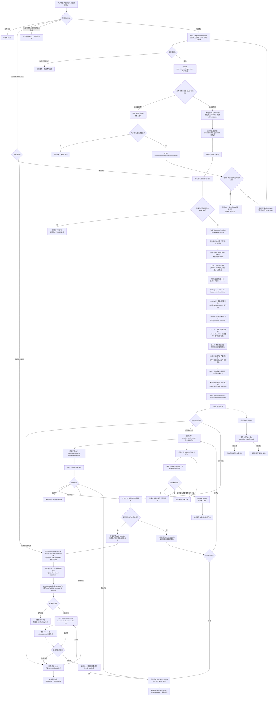

```mermaid
flowchart TD
    A["用户点击「立即挂号并医保支付」"] --> B{"页面状态校验"}
    B -->|正在处理| Z0["忽略本次点击"]
    B -->|存在待完成医保支付| RP{"待完成阶段"}
    RP -->|医保授权| R1["重新进入医保授权小程序"]
    RP -->|微信混合支付| WP0["POST /payments/medical-insurance/orders/:id/wechat-pay<br/>读取 6202 金额并创建微信医保混合单"]
    B -->|未选择就诊人或预约数据未就绪| Z1["提示补全就诊人、排班或号源"]
    B -->|校验通过| H["POST /appointments/holds<br/>占用指定日期、上午、分时段号源"]

    H --> H1{"服务端校验"}
    H1 -->|失败或号源失效| E1["流程结束：提示预约失败"]
    H1 -->|成功| G["POST /appointments/registrations<br/>写入预约"]

    G --> G1{"服务端查询患者当日已有预约"}
    G1 -->|发现重复预约| D["页面展示已有预约<br/>不重复挂号"]
    D --> D1{"用户确认取消并重挂？"}
    D1 -->|否| Z2["流程结束：保留原预约"]
    D1 -->|是| C["POST /appointments/registrations/:id/cancel"]
    C --> C1{"医保订单是否已产生支付流水？"}
    C1 -->|是| E2["返回 409：先完成或由收费端处理<br/>原预约卡片保留"]
    C1 -->|否| C2["调用预约取消 Provider<br/>预约状态改为 cancelled"]
    C2 --> H
    G1 -->|无重复预约| G2["调用预约写入 Provider<br/>预约状态 booked，号源 hold consumed"]
    G2 --> P0["保存待支付引用：appointmentId、patientId、幂等键"]

    P0 --> R0["跳转医保授权小程序"]
    R0 --> R1
    R1 --> R2{"医保授权回跳是否带 authCode？"}
    R2 -->|否| R3["保留待支付状态<br/>提示用户点击继续授权"]
    R2 -->|是| A1["POST /payments/medical-insurance/authorize"]

    A1 --> A2["服务端校验会话、预约归属、幂等键"]
    A2 --> A3["userQuery：authCode + openid<br/>解析 payAuthNo"]
    A3 --> A4["1101：查询参保信息<br/>psnNo、insutype、参保地、人员信息"]
    A4 --> A5["保存加密授权上下文<br/>医保订单状态 authorized"]

    A5 --> F0["POST /payments/medical-insurance/orders/:id/fees"]
    F0 --> F1["2.6.65.1：申请医保结算主单<br/>校验真实 getAmount = 预约金额"]
    F1 --> F2["2.6.65.2：创建医保支付流水<br/>取得 payingId、tradingId"]
    F2 --> F3["2.27.2.27：读取真实费用明细<br/>outSettleDetailList、结算主单、参保结算信息"]
    F3 --> F4["2.1.9：解析医保科室<br/>2.1.13：解析医保医生"]
    F4 --> F5["2.6.33：读取门诊子支付记录<br/>补齐子项目与个人账户使用标记"]
    F5 --> F6["6201：上传真实费用明细、诊断和参保信息"]
    F6 --> F7["保存加密结算凭证与结算上下文<br/>医保订单状态 fee_uploaded"]

    F7 --> S0["POST /payments/medical-insurance/orders/:id/settle"]
    S0 --> S1["6202：医保结算"]
    S1 --> S2{"6202 返回状态"}
    S2 -->|明确失败或取消| SF["医保订单 failed<br/>记录 provider 状态和日志"]
    S2 -->|处理中或未知| Q0["医保订单 awaiting_confirmation<br/>写入查单任务"]
    S2 -->|结算候选| N0["2.27.2.32：提交完整结算通知"]
    N0 --> N1{"是否有待支付自费金额？"}
    N1 -->|是| CP["医保订单 cash_pending<br/>前端提示存在待支付自费金额"]
    N1 -->|否| N2["2.6.65.5：complete-settle<br/>确认医保结算最终成功"]
    N2 --> N3{"最终确认结果"}
    N3 -->|成功| OK["医保订单 insurance_settled<br/>挂号和医保支付成功"]
    N3 -->|未确认| Q0

    Q0 --> Q1["前端轮询 GET /payments/medical-insurance/orders/:id"]
    Q1 --> Q2["6301：查医保订单状态"]
    Q2 --> Q3{"查单结果"}
    Q3 -->|结算候选| N0
    Q3 -->|处理中| Q4["继续轮询或由 Worker 重试"]
    Q3 -->|明确失败| SF
    Q3 -->|最终成功| OK

    Q0 -.-> W0["医保补偿 Worker 领取查单任务"]
    W0 --> W1["调用 6301 并校验金额、订单状态和状态迁移"]
    W1 --> W2{"是否达到终态？"}
    W2 -->|否| W3["按退避时间重新入队"]
    W3 --> W0
    W2 -->|是| W4["关闭查单任务并回写医保订单"]
    W2 -->|超过最大次数或数据不一致| MR["manual_review<br/>后台人工处理"]

    S1 -.-> NTF0["医保异步回调 6302"]
    NTF0 --> NTF1["校验 callType=02、payOrdId、medOrgOrd"]
    NTF1 -->|校验失败| NTF2["拒绝回调并记录安全日志"]
    NTF1 -->|校验通过| NTF3["幂等回写医保订单状态"]

    OK --> OK1["前端清除 pendingPayment<br/>保存 lastResult，展示成功"]
    CP --> WP0
    WP0 --> WP1["微信 APIv3：JSAPI 自费预下单<br/>再 POST /v3/med-ins/orders"]
    WP1 --> WP2["wx.requestMedicalInsurancePay<br/>传入 mixTradeNo、prepay_id、paySign"]
    WP2 --> WP3{"微信调起结果"}
    WP3 -->|用户取消| CP1["保留待支付状态<br/>不清除 pendingPayment"]
    WP3 -->|调起成功| WQ0["GET /payments/medical-insurance/orders/:id/wechat-pay"]
    WQ0 --> WQ1["微信 APIv3：按 mix_trade_no 查混合单"]
    WQ1 --> WQ2{"自费和医保状态"}
    WQ2 -->|处理中| WQ0
    WQ2 -->|失败/冲正| SF
    WQ2 -->|均成功| WQ3["调用 6301 查医保后置结果并完成 HIS 结算"]
    WQ3 -->|未完成| WQ0
    WQ3 -->|完成| OK
    SF --> SF1["前端展示失败<br/>不重新挂号、不重新授权"]
    MR --> MR1["前端提示查看后台订单日志"]
```
