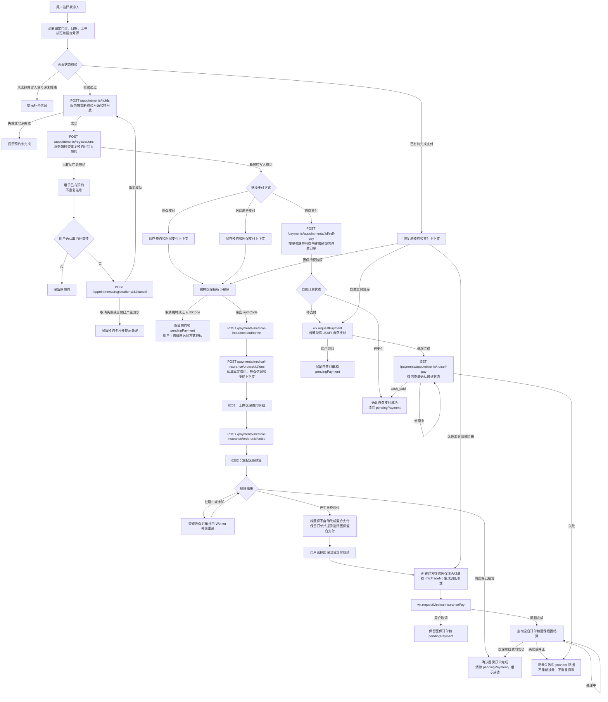

```mermaid
flowchart TD
    A[用户选择就诊人] --> B[读取固定门诊、日期、上午排班和指定号源]
    B --> C{页面状态校验}
    C -->|已有待完成支付| P[恢复原预约和支付上下文]
    C -->|未选择就诊人或号源未就绪| E0[提示补全信息]
    C -->|校验通过| H[POST /appointments/holds<br/>服务端重新校验号源和挂号费]
    H -->|失败或号源失效| E1[提示预约未完成]
    H -->|成功| R[POST /appointments/registrations<br/>服务端检查重复预约并写入预约]
    R -->|已有同门诊预约| D[展示已有预约<br/>不重复挂号]
    D --> D1{用户确认取消并重挂}
    D1 -->|否| E2[保留原预约]
    D1 -->|是| X[POST /appointments/registrations/:id/cancel]
    X -->|取消失败或支付已产生流水| E3[保留预约卡片并提示处理]
    X -->|取消成功| H
    R -->|新预约写入成功| M{选择支付方式}

    M -->|医保支付| MI0[保存预约和医保支付上下文]
    M -->|医保混合支付| MX0[保存预约和医保支付上下文]
    M -->|自费支付| S0[POST /payments/appointments/:id/self-pay<br/>按服务端挂号费创建普通微信自费订单]

    MI0 --> AUTH[跳转医保授权小程序]
    MX0 --> AUTH
    AUTH -->|取消跳转或无 authCode| AP[保留预约和 pendingPayment<br/>用户可选择原医保方式继续]
    AUTH -->|带回 authCode| A1[POST /payments/medical-insurance/authorize]
    A1 --> F1[POST /payments/medical-insurance/orders/:id/fees<br/>读取真实费用、参保信息和授权上下文]
    F1 --> F2[6201：上传医保费用明细]
    F2 --> S1[POST /payments/medical-insurance/orders/:id/settle]
    S1 --> S2[6202：发起医保结算]
    S2 --> Q{结算结果}
    Q -->|处理中或未知| Q1[查询医保订单并由 Worker 补偿重试]
    Q1 --> Q
    Q -->|纯医保已结算| OK1[确认医保订单完成<br/>清除 pendingPayment，展示成功]
    Q -->|产生自费应付| CASH[纯医保不自动改成混合支付<br/>保留订单并提示选择医保混合支付]
    CASH --> MX1[用户选择医保混合支付继续]
    MX1 --> MX2[创建官方微信医保混合订单<br/>按 mixTradeNo 生成调起参数]
    MX2 --> MX3[wx.requestMedicalInsurancePay]
    MX3 -->|用户取消| MX4[保留医保订单和 pendingPayment]
    MX3 -->|调起完成| MX5[查询混合订单和医保后置结算]
    MX5 -->|处理中| MX5
    MX5 -->|医保和自费均成功| OK1
    MX5 -->|失败或冲正| FAIL[记录失败和 provider 证据<br/>不重新挂号、不重复扣款]

    S0 --> S3{自费订单状态}
    S3 -->|已支付| OK2[确认自费支付成功<br/>清除 pendingPayment]
    S3 -->|待支付| S4[wx.requestPayment<br/>普通微信 JSAPI 自费支付]
    S4 -->|用户取消| S5[保留自费订单和 pendingPayment]
    S4 -->|调起完成| S6[GET /payments/appointments/:id/self-pay<br/>微信查单确认最终状态]
    S6 -->|处理中| S6
    S6 -->|cash_paid| OK2
    S6 -->|失败| FAIL

    P -->|医保授权阶段| AUTH
    P -->|医保混合现金阶段| MX2
    P -->|自费支付阶段| S4
```
