# Hospital Platform 完整体业务流程图

> 审计基线：2026-08-24。本文按当前工作区实际注册的路由、页面事件、service、domain、adapter、repository 和 worker 绘制；“代码文件存在”不等于“用户入口已开放”。

## 1. 先看结论

- 患者端主链路：原生微信小程序 → 公网 Nginx `/api/v2` → Elysia 内部 `/api/v1` → 认证/业务 service → domain contract → MySQL/Redis 或 Provider adapter。
- 当前实际开放的患者端业务以“登录、患者目录同步、预约只读目录、预约历史/爽约只读、报告目录/部分检验详情、门诊费用只读、普通资料”为主。
- 预约下单、锁号、取消、挂号费、医保结算、门诊缴费调起、报告下载/分享/复诊、健康百科公共挂载、智能服务等没有被当前代码证明为可用。
- 支付 API、微信通知验签解密、outbox 和查单 worker 已有代码边界，但 `WECHAT_PAYMENT_READY`/完整配置/真实验收同时满足前，运行时保持 fail-closed；当前小程序门诊费用页面不调用 `wx.requestPayment`。
- `.codegraph/codegraph.db` 当前已存在；本文同时使用 codeGraph 的静态节点/边和源码实际逻辑。对于同名方法产生的歧义边，必须回到源码和真实 HTTP 路径确认，不能把“有边”直接等同于“有业务调用”。

## 2. CodeGraph 静态调用证据与解释边界

当前 `.codegraph/codegraph.db` 的本机索引快照如下：

| 指标 | 数量或版本 | 解释 |
| --- | ---: | --- |
| indexed extraction version | `24` | 当前提取器版本 |
| files | `230` | TypeScript 213、JavaScript 14、YAML 3 |
| nodes | `4,475` | 文件、函数、方法、类型、属性等 |
| edges | `15,337` | calls 5,609；imports 2,056；references 2,724；contains 4,248 |
| unresolved refs | `0` | 符号解析没有留下未解析引用；不等于业务语义已经验证 |

CodeGraph 能直接证明组合根的注册关系：

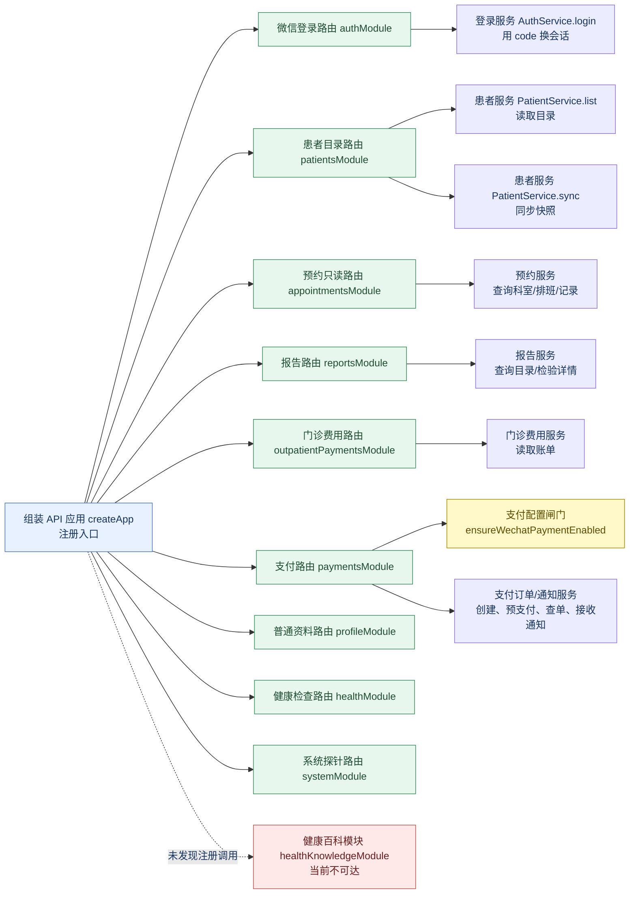

小程序 service 层的静态关系则是：`api-client.login → performLogin`；`syncPatients → requestWithSession`；`requestWithSession → login / requestForSession / requestAfterSessionRecovery`；`launchWechatPayment → requestWechatPrepay → toWechatPaymentParams`。对 `launchWechatPayment` 做反向 `calls` 查询没有找到页面或 service 调用者，这与源码中“仅定义支付调起函数、当前门诊费用页面不调用它”的结论一致。

CodeGraph 仍然需要语义复核：当前索引会把 `performLogin` 内部的 HTTP `request` 按同名符号误连到服务端 `AuthService.login`，也会把门诊费用 service 的 `list` 误连到预约 service 的 `listRecords`。源码实际分别是 `POST /auth/wechat` 和门诊费用 Provider 查询。因此本文采用“CodeGraph 发现候选调用边 → 源码确认函数体/路由 → Provider 与运行闸门确认可达性”的证据顺序。

## 3. 图例

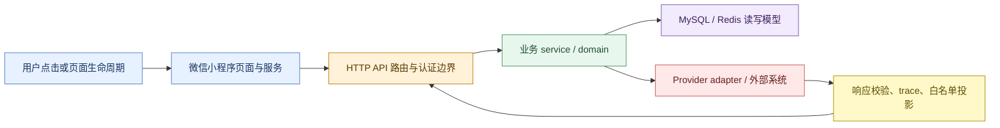

### 3.1 把工程名翻译成业务动作

流程图中的英文是源码中的真实名称，但它们对应的业务含义如下。阅读时先看“中文含义”，再用括号中的名称回到代码核对。

| 图中名称 | 中文含义 | 它在流程中的责任 |
| --- | --- | --- |
| `onLaunch` / `onLoad` | 小程序启动 / 页面打开 | 初始化配置、恢复会话、触发页面数据加载；不是用户点击接口 |
| `api-client` | 小程序统一请求客户端 | 拼接公网地址、带上 Bearer、处理 401 重登、把接口错误翻译成页面可用错误 |
| `/api/v2` | 公网接口版本 | 小程序实际请求的前缀；由 Nginx 转给服务端内部 `/api/v1` |
| `createApp` | API 应用组装入口 | 把路由模块、认证、日志、错误处理和 readiness 注册到 Elysia |
| `Module` | 某个业务的路由模块 | 把 HTTP 方法和 URL 绑定到 service；本身不等于业务已经有页面入口 |
| `Service` | 业务决策层 | 校验 owner、patient、日期、状态、幂等和 Provider 返回结果 |
| `Domain` | 领域规则层 | 定义合法状态、金额、opaque ID、报告/患者/支付读模型 |
| `Adapter` / `Provider` | 外部系统适配器 / 外部系统 | Adapter 把众阳或微信的协议转换成平台模型；Provider 是真正的外部接口 |
| `Repository` | 数据库读写仓库 | 读写 MySQL 中的用户、患者、映射、报告引用、支付和 outbox |
| `Session store` | 会话存储 | Redis 保存 Bearer token 对应的内部 userId 和过期时间 |
| `opaque ID` | 对外不可推断的短期标识 | 例如 `scheduleId`、报告短期 `reportId`；避免把 Provider 主键直接暴露给小程序 |
| `clinicalAccess=ready` | 当前患者可以进入临床业务 | 只有当前用户拥有该患者，且服务端已经取得有效 `his-patient` 映射时才成立 |
| `fail-closed` | 依赖不满足就拒绝或不给数据 | 不用空数组假装“没有记录”，也不把数据库/Provider 故障伪装成登录失败 |

### 3.2 所有“患者相关查询”都会先经过同一条门禁

用户看到的“报告、挂号、爽约、门诊费用”虽然是不同页面，但在发出各自业务请求前都要走下面这条公共链路：

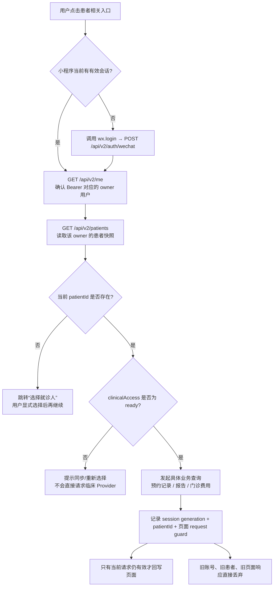

逐步解释：

1. 小程序先判断本地会话状态；没有会话时只调用登录，不会把内部 `patientId` 当作登录凭证。
2. `GET /me` 用 Bearer token 反查 Redis，确认这个请求属于哪个内部用户；Redis 故障是 `503`，不是 `401 未登录`。
3. `GET /patients` 只返回当前用户自己的患者目录。服务端返回的平台 `patientId` 与 Provider 的 `his-patient` 分开保存。
4. 页面必须有一个当前选中的 `patientId`，并且该患者的 `clinicalAccess` 为 `ready`；否则进入选择/同步页面。
5. 业务请求仍会在服务端再次验证 owner、患者归属和 Provider 映射，不能依赖小程序传来的字段。
6. 页面切换患者、退出登录或重新登录后，旧请求即使晚返回，也不能覆盖新患者页面。

## 4. 总体架构与真实可达边界

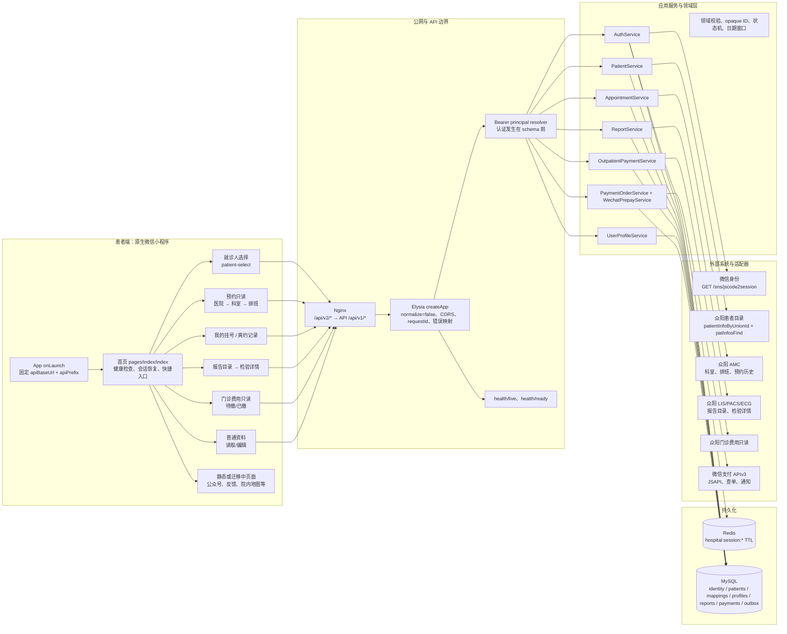

### 4.1 一次真实业务请求的逐层过程

例如用户在小程序里点击“查询报告”，不是页面直接访问众阳，而是经过以下 8 层：

| 顺序 | 用户/系统看到的动作 | 实际发生的事情 | 失败时的结果 |
| ---: | --- | --- | --- |
| 1 | 点击“报告查询” | 页面检查会话和当前患者，生成本次请求的 session generation | 没会话或没患者时跳转登录/选择就诊人 |
| 2 | 小程序发请求 | `api-client` 发送 `GET https://test-hp.meiyi.pro/api/v2/reports?...`，附带 `Authorization: Bearer ...` 和 `x-request-id` | 网络错误由客户端转成安全中文提示 |
| 3 | Nginx 转发 | 公网 `/api/v2/reports` 映射到 API 内部 `/api/v1/reports`；Nginx 不负责业务判断 | 代理/服务不可达时不会得到业务成功响应 |
| 4 | API 认证 | `request-authentication` 从 Bearer 解析内部 userId，并由 Redis 校验 token | token 无效返回 `401`；Redis 依赖失败返回 `503` |
| 5 | 路由进入 service | `reportsModule` 读取 query/body/header，把 owner、patientId 和上下文交给 `ReportService.list` | 字段、日期、kind 不合法返回 `400` |
| 6 | Service 做业务判断 | 验证患者属于 owner，解析服务端 `his-patient` 映射，限制日期窗口和报告类型 | 患者映射缺失、依赖未注入或冲突时拒绝，不返回伪造空列表 |
| 7 | Adapter 访问外部系统 | 众阳报告 Adapter 分别查询 LIS、影像、心电接口，再把 Provider 字段投影成平台报告读模型 | Provider 暂时失败为 `503`；响应结构非法为 `502` |
| 8 | 页面收到结果 | Service 返回 `success=true + data`；客户端和页面 request guard 再检查患者/会话是否仍然一致 | 如果页面已切换患者，结果被丢弃，不污染当前页面 |

因此图中“页面 → API → Service → Adapter → Provider”不是抽象分层，而是一次点击实际经过的先后顺序。数据库和 Redis 可能在认证、患者映射、报告短期引用等不同位置被访问，不代表每个业务都一定写数据库。

## 5. 启动、健康检查与 API 运行时闸门

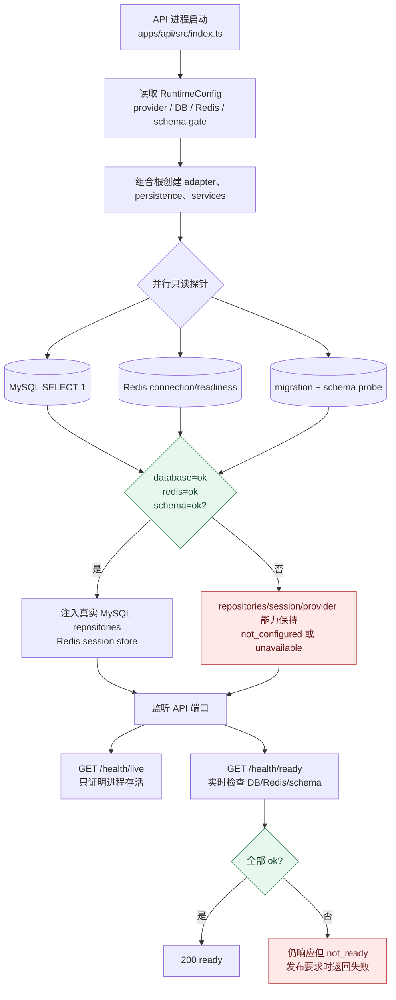

关键事实：readiness 不是业务成功证明；schema 未通过时，API 可以继续提供 health/readiness，但业务 repositories 不会被伪装成可用。每个受保护请求还要经过 Bearer session 校验，Redis 故障返回暂时不可用，不能被错误映射成“用户未登录”。

### 5.1 启动时每个检查分别代表什么

| 检查 | 检查内容 | 通过后能做什么 | 没通过时不能做什么 |
| --- | --- | --- | --- |
| 配置读取 | 微信、众阳、支付、数据库、Redis、加密密钥等配置是否存在 | 允许创建对应 Adapter | 未配置的 Adapter 返回 `dependency-not-configured` |
| MySQL 探针 | 基础连接和 schema/migration 状态 | 注入真实 Repository | 不能把内存空仓库当作生产数据 |
| Redis 探针 | 连接和读写就绪 | 创建真实 session store | 受保护接口不能稳定验证 Bearer |
| Provider gate | 众阳/微信所需地址、认证配置是否完整 | 允许该外部读接口进入 service | 业务接口保持不可用或只展示安全错误 |
| 支付 gate | `WECHAT_PAYMENT_READY`、商户号、证书、APIv3 密钥、加密密钥等全部满足 | 订单、预支付、通知、查单链路才可能启用 | 支付路由直接拒绝，避免“半配置支付” |
| `/health/live` | 进程是否还在监听 | 证明进程活着 | 不能证明数据库、Redis 或 Provider 可用 |
| `/health/ready` | 实时 DB/Redis/schema 状态 | 供部署/反向代理判断是否接流量 | `not_ready` 时不应把它当作业务验收通过 |

## 6. 用户登录与会话恢复

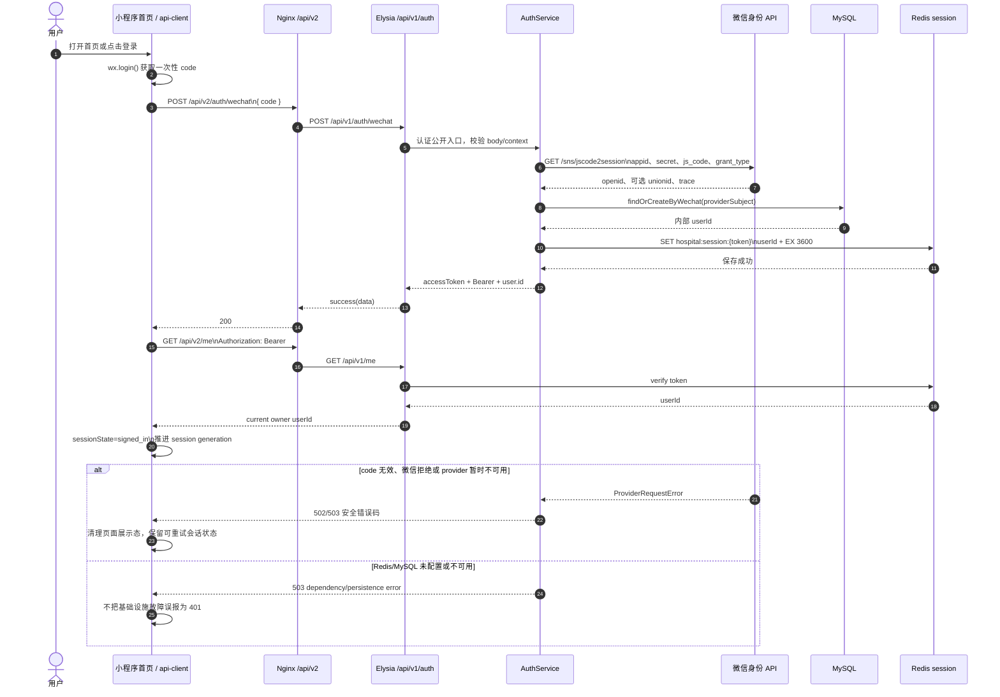

### 6.1 用户点击“登录”后，前后端各自做什么

| 步骤 | 所在位置 | 具体动作 | 关键判断/产物 |
| ---: | --- | --- | --- |
| 1 | 微信小程序 | 调用 `wx.login()` 获取一次性 `code` | `code` 只能交给服务端兑换；小程序不接触微信 `secret` |
| 2 | 小程序请求客户端 | 调用 `POST /api/v2/auth/wechat`，body 为 `{ code }` | 这是公开登录入口，不需要先带 Bearer |
| 3 | Nginx/API | 将公网地址转到内部 `POST /api/v1/auth/wechat` | 路由校验 code 长度/类型并建立 request context |
| 4 | `AuthService.login` | 调用微信身份 Adapter 的 `exchangeCode` | Adapter 请求 `GET https://api.weixin.qq.com/sns/jscode2session` |
| 5 | 微信身份接口 | 返回 `openid`、可选 `unionid` 等身份结果 | `session_key` 只用于服务端流程，不能出现在返回体 |
| 6 | MySQL identity repository | 按微信 provider subject 查找或创建内部用户 | 对外不使用 openid 作为患者业务 ID，生成内部 `userId` |
| 7 | Redis session store | 保存 `token → userId`，TTL 默认 3600 秒 | 返回给小程序的是 access token，不是微信 session_key |
| 8 | 小程序 | 保存 token，状态切换为 `signed_in`，session generation 增加 | 后续请求使用 `Authorization: Bearer <token>` |
| 9 | 小程序首页 | 调用 `GET /api/v2/me` | 验证 token 还有效，并确认当前 owner |
| 10 | 小程序首页 | 继续读取/同步患者目录 | 只有患者目录加载完成后，患者相关页面才有条件继续 |

登录失败时的中文含义：`401` 是 token/code 不被接受；`502` 是微信返回结构不符合预期；`503` 是微信、MySQL 或 Redis 等依赖暂时不可用。三者不能都显示成“请重新登录”，否则用户会错误地重复登录而无法修复基础设施问题。

登录之后的首页初始化不是“拿到 token 就完成”：

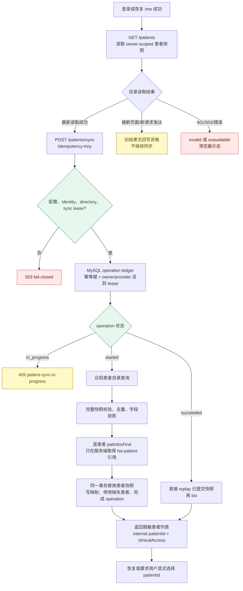

患者同步的关键数据边界：

- 小程序只提交 `wx.login` code、内部 opaque `patientId` 和幂等键；不提交 unionId、openid、身份证号或 Provider 患者号。
- 众阳目录通常先走 `/api/public/patientInfoByUnionId`，再按患者资料走 `/msun-middle-aggregate-patient/v1/patInfosFind`；`his-patient` 映射只保存在服务端。
- 完整快照缺失的患者会被标记 inactive，不物理删除，以保留历史订单/报告等外键语义；缺失 `his-patient` 映射的患者 `clinicalAccess` 不再是 ready。

### 6.2 “同步患者”不是简单刷新列表

用户点击“新增就诊人/同步患者”后，服务端会把一次同步当成可重试的长事务处理：

1. 路由从 Bearer 得到 owner，不允许小程序指定另一个 owner。
2. 读取该 owner 的微信身份，确认有可供 Provider 查询的身份事实。
3. 用 `Idempotency-Key` 查 `hp_patient_directory_sync_operations`；相同 owner + key 的成功操作可以 replay，进行中的操作返回 `409 patient-sync-in-progress`。
4. 获取租约后访问众阳患者目录，先得到患者集合，再对完整快照逐项校验、去重和限制数量。
5. 对需要临床访问的患者获取 `his-patient` 引用；该 Provider 编号只存在服务端映射表，不返回给小程序。
6. 在同一事务中替换当前快照：新患者写入、旧快照缺失项标记 inactive、映射写入、operation 标记 succeeded。
7. 最后重新执行 owner-scoped list，返回小程序可展示的 `patientId`、姓名等脱敏字段和 `clinicalAccess`。

所以“患者列表为空”可能代表真实没有患者，也可能是同步未配置、同步冲突、Provider 暂时失败或快照被保护性拒绝；代码不会把这些情况统一伪装为成功空数组。

## 7. 首页点击分流

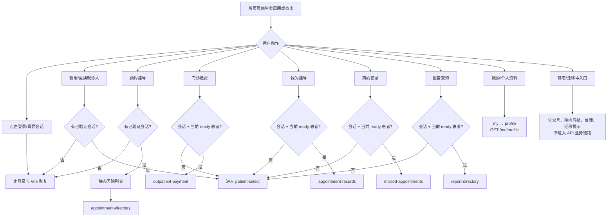

### 7.1 首页每个入口点击后到底去哪

| 用户点击 | 页面先做的判断 | 接下来打开/调用 | 用户当前能看到的结果 |
| --- | --- | --- | --- |
| 登录/首页主入口 | 是否已有有效 session | 没有则 `wx.login → POST /auth/wechat`；有则恢复 `/me` | 登录后进入患者选择或首页恢复 |
| 新增/更换就诊人 | 是否已有 session | `patient-select`；必要时 `GET /patients` 或 `POST /patients/sync` | 选择一个当前患者，建立 patient context |
| 预约挂号 | 只要求会话，不要求先选患者 | `hospital-list` → `appointment-directory` → `GET /appointments/departments` | 可以查看医院、科室和未来排班；不能下单 |
| 门诊缴费 | 会话 + 当前患者 + `clinicalAccess=ready` | `outpatient-payment` → `GET /payments/outpatient/records` | 查看待缴/已缴费用；不会调微信支付 |
| 我的挂号 | 会话 + 当前患者 + ready | `appointment-records` → `GET /appointments/records` | 查看平台预约摘要；详情/预问诊仍迁移中 |
| 爽约记录 | 会话 + 当前患者 + ready | `missed-appointments` → 同一 records 接口，过去 90 天 | 查看过去窗口中的爽约记录 |
| 报告查询 | 会话 + 当前患者 + ready | `report-directory` → `GET /reports` | 查看报告目录；部分检验报告可继续取详情 |
| 我的/个人资料 | 只要求会话 | `my` → `GET /me/profile`、`GET /patients` | 查看或编辑普通资料；患者管理另走同步链路 |
| 公众号、反馈、院内导航 | 无对应业务 API 或本地资源 | 静态页面、电话拨号、`wx.previewImage` 或迁移 Toast | 不能把页面存在理解成后台工单、导航或智能服务已经接通 |

特别注意：点击“预约挂号”与点击“门诊缴费”不是同一种门禁。预约目录只需要会话，因为它是公共只读排班；门诊费用、报告和记录必须绑定当前患者，服务端会额外验证患者归属和 Provider 映射。

页面侧所有受保护业务读取都遵循同一组合原则：先 `GET /me` 确认 owner，再 `GET /patients` 解析当前显式选择，再以同一 session generation 发起 patient-scoped 查询；请求前后都检查页面 request guard、会话代际和当前 `patientId`，过期响应不得回写页面。

## 8. 预约只读目录

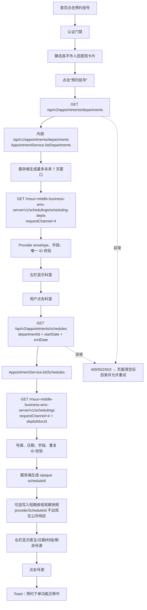

当前没有从该页面触发的预约写入 API。`POST /appointments`、锁号、取消和挂号费在 runtime smoke 中属于刻意关闭边界，不能把 `scheduleId` 解释成已经获得 Provider 写入授权。

### 8.1 预约目录的两个请求和一个“没有请求”的点击

#### 第一个请求：加载科室

用户进入预约页面后，页面调用：

`GET /api/v2/appointments/departments`

服务端内部过程是：

1. 认证 Bearer，确认请求拥有合法 session。
2. `appointmentsModule` 读取请求上下文，调用 `AppointmentService.listDepartments`。
3. Service 根据当前时间生成最多未来 7 天的查询窗口，并构造 request channel `4`。
4. 众阳 AMC Adapter 请求科室接口：`/msun-middle-business-amc-server/v1/schedulings/scheduling-depts`。
5. Adapter 检查响应 envelope、科室名称、Provider ID、trace 和重复项。
6. API 只返回平台科室模型；Provider 原始对象和认证信息不会直接返回。

页面结果：左侧显示科室。如果接口失败，旧科室列表会被清空，页面显示可重试错误，不会继续使用上一家医院/上一次查询的旧数据。

#### 第二个请求：加载某个科室的排班

用户点击科室后，页面调用：

`GET /api/v2/appointments/schedules?departmentId=...&startDate=...&endDate=...`

服务端再做这些事情：

1. 校验日期格式、开始/结束范围和 departmentId 是否为允许的 opaque ID。
2. `AppointmentService.listSchedules` 将平台科室标识映射为 Provider 所需的 `deptId/docId`。
3. 众阳 AMC Adapter 请求 `/msun-middle-business-amc-server/v1/schedulings`，带 `requestChannel=4`。
4. 校验医生、日期、时间段、剩余号源、重复排班和 Provider trace。
5. 为每个排班生成平台自己的短期 `scheduleId`；Provider 排班主键不直接暴露。
6. 如启用排班观察快照，则短期写入 `hp_appointment_schedule_snapshots`；快照失败不会阻断纯只读目录。

页面结果：右侧显示医生、日期、时间段和剩余号源。用户继续点击号源时，当前代码只显示“预约下单功能迁移中”，没有 `POST /appointments`、锁号、挂号费或取消请求；因此流程在这里结束，不会产生预约订单。

## 9. 我的挂号与爽约记录

```mermaid
flowchart LR
    Records[我的挂号] --> RQuery[GET /api/v2/appointments/records\npatientId + startDate/endDate]
    Missed[爽约记录] --> MQuery[同一 GET 路由\n过去 90 天窗口]
    RQuery --> Service[AppointmentService.listRecords\nowner 来自 Bearer]
    MQuery --> Service
    Service --> Ref[MySQL resolveProviderReference\nprovider=zhongyang\nreferenceKind=his-patient]
    Ref --> RefOK{映射存在且 owner/patient 匹配?}
    RefOK -->|否| NotFound[业务错误：当前患者暂无可查询记录]
    RefOK -->|是| Provider[GET /msun-middle-business-appointment-server/v1/appointment-infos/{patId}\nrequestChannel=3、isMzFlag=1、dateFlag=1]
    Provider --> Validate[字段/日期/重复记录/trace 校验]
    Validate --> View[只返回平台预约摘要\n小程序本地分页/筛选]
    View --> Detail[点击记录]
    Detail --> DetailRoute[GET /api/v2/appointments/registrations/{appointmentId}?patientId=...]
    DetailRoute --> DetailAuth[服务端校验 owner、患者和预约归属]
    DetailAuth --> DetailView[展示脱敏挂号详情]
    View --> Actions[预问诊、全部挂号等未开放动作\n显示迁移提示]
```

“我的挂号”覆盖中国标准时间前后各 90 天；“爽约记录”只覆盖过去 90 天。两者复用 Provider 记录接口，但页面和 service 的窗口语义不同，未知窗口不会静默降级为普通历史查询。

### 9.1 “我的挂号”和“爽约记录”的差别

| 页面 | 小程序传入的窗口 | 服务端最终查询窗口 | 页面处理 |
| --- | --- | --- | --- |
| 我的挂号 | 当前日期前 90 天到后 90 天 | 过去/未来各 90 天，按 Asia/Shanghai 生成 | 本地分页和展示预约状态 |
| 爽约记录 | 当前日期前 90 天到当前日期 | 只查过去 90 天 | 本地筛选爽约状态，不另造 Provider 接口 |

两条页面路径最终都会：

1. 带上当前平台 `patientId` 和日期窗口请求 `/api/v2/appointments/records`。
2. Service 从 owner 的患者映射中找到 Provider `his-patient`，而不是相信小程序上传的 Provider 患者号。
3. Adapter 请求 `/msun-middle-business-appointment-server/v1/appointment-infos/{patId}`，固定带 `requestChannel=3`、`isMzFlag=1`、`dateFlag=1`。
4. Service 校验记录日期、状态、重复项、trace，并把 Provider 字段转换成平台预约摘要。
5. 小程序只对已经返回的平台摘要做分页；点击详情、预问诊和“全部挂号”当前没有对应真实写入/详情链路，会显示迁移提示。

如果映射不存在，用户看到的是业务不可查询/需要重新同步，而不是服务端拿一个未经授权的 patId 去请求众阳。

## 10. 报告目录与检验详情

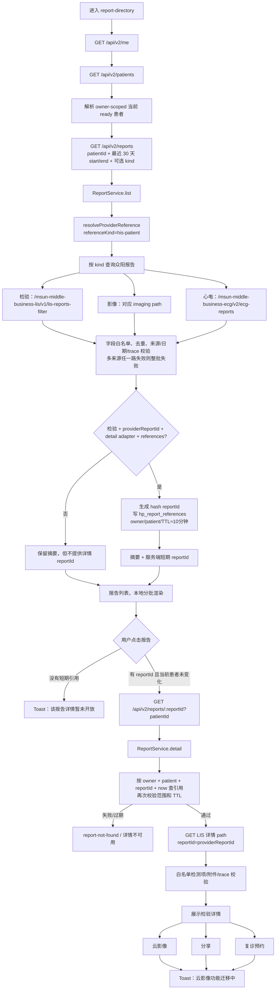

影像与心电当前只证明目录适配器存在；详情页的已接入路径是检验详情。报告目录请求的 Provider 结果不是“有一条成功就返回”，未指定 `kind` 时三路结果会合并，任一路响应异常都保持整批 fail-closed，避免把缺失报告伪装成空列表。

### 10.1 报告目录为什么会有多次外部查询

用户只点击一次“报告查询”，但当没有指定报告类型时，Service 会并行查询三类 Provider 目录：

| 报告类型 | 外部系统/接口含义 | 当前页面结果 |
| --- | --- | --- |
| 检验 | LIS 检验报告目录：`/msun-middle-business-lis/v1/lis-reports-filter` | 可能获得短期详情入口 |
| 影像 | PACS/影像报告目录 Adapter | 目前主要展示目录摘要，云影像查看仍迁移中 |
| 心电 | ECG 报告目录：`/msun-middle-business-ecg/v2/ecg-reports` | 目前展示目录摘要 |

Service 会先拿 `his-patient` 映射，再对每路响应做白名单字段投影、日期范围检查、重复 ID 检查和 trace 记录。三路不是“成功两路就返回两路”：未指定 `kind` 时任一路 Provider 结果不合法，整批保持 fail-closed，防止用户误以为“没有报告”。

### 10.2 点击一条报告后，为什么有的能打开、有的只能提示

1. 报告目录返回的不是 Provider 原始报告号；只有“检验 + 有详情适配器 + Provider 报告号合法”时，Service 才生成短期平台 `reportId`。
2. 该 `reportId` 是 owner、patient 和 Provider 报告号的 hash 结果，并写入 `hp_report_references`，有效期约 10 分钟。
3. 用户点击报告时，小程序把平台 `reportId` 和当前 `patientId` 请求 `GET /api/v2/reports/:reportId?patientId=...`。
4. Service 再次验证 owner、patient、reportId、报告类型、引用存在和 TTL；任何一项不匹配都返回安全的 not-found/详情不可用。
5. 通过后，Adapter 才用服务端保存的 Provider 报告号调用 LIS 详情接口，校验检测项、附件和 trace 后返回详情。
6. 页面切换患者、引用过期或报告没有详情能力时，页面不尝试猜 Provider ID，直接显示“该报告详情暂未开放”。

因此列表里“有报告”只代表目录摘要可用，不代表影像原图、下载、分享、复诊预约等后续能力已经接通。

## 11. 门诊费用只读链路

```mermaid
flowchart TD
    OpenFee[进入 outpatient-payment] --> Context[GET /me → GET /patients\n确认 owner + ready patient]
    Context --> Tab[点击“待缴费”或“已缴费”]
    Tab --> Query[GET /api/v2/payments/outpatient/records\npatientId + status=unpaid|paid]
    Query --> Service[OutpatientPaymentService.list]
    Service --> Window[按 Asia/Shanghai 生成最近 30 个自然日窗口]
    Window --> Ref[resolveProviderReference\nreferenceKind=his-patient]
    Ref --> Provider[GET /msun-middle-open-settlepay/v1/outpatient-payments/outpatient-child-payment-records\npatId + startTime/endTime + authSysCode]
    Provider --> StatusMap[unpaid→tradeStatus=1\npaid→tradeStatus=3]
    StatusMap --> Validate[账单日期、金额分、状态和 trace 校验]
    Validate --> FeeUI[展示金额、日期、科室/医生、已缴/待缴摘要]
    FeeUI --> Tap[点击账单]
    Tap --> Detail[GET /api/v2/payments/outpatient/records/{recordId}\n再次校验 owner + patientId + status]
    Detail --> Local[展示已核对费用摘要\n不调用 wx.requestPayment]
    FeeUI --> ChangePatient[更换就诊人]
    ChangePatient --> Context
```

该 adapter 明确是“门诊费用只读”，不承载支付调起、医保结算或退款。Provider 返回窗口外账单时整批拒绝，而不是静默过滤，以免用户看到不完整的账本。

### 11.1 用户点击“待缴费/已缴费”后的完整过程

1. 页面先执行 `GET /me` 和 `GET /patients`，确认当前登录用户和当前 ready 患者。
2. 用户点击“待缴费”时传 `status=unpaid`；点击“已缴费”时传 `status=paid`，两者都传平台 `patientId`。
3. API 路由 `outpatientPaymentsModule` 做 query schema 校验，再调用 `OutpatientPaymentService.list`。
4. Service 以中国标准时间生成最近 30 个自然日的 `startTime/endTime`，不接受小程序任意扩大时间范围。
5. Service 根据 owner + patient 找到 `his-patient`，再调用门诊费用 Adapter。
6. Adapter 请求 `/msun-middle-open-settlepay/v1/outpatient-payments/outpatient-child-payment-records`，把 `unpaid` 翻译为 Provider `tradeStatus=1`，把 `paid` 翻译为 `tradeStatus=3`，同时带 `authSysCode`。
7. Service 检查每条账单日期必须在请求窗口内，并校验金额、状态、字段数量和外部 trace；窗口外记录会导致整批拒绝。
8. 页面只展示金额、账单时间、科室/医生和缴费状态。点击账单再调用 `GET /api/v2/payments/outpatient/records/{recordId}`，由服务端复用同一患者范围查询并核对记录引用；详情不会创建订单、不会调用 `wx.requestPayment`，也不会改变服务端缴费状态。

这里“待缴费”只是众阳门诊账单的状态筛选，不等于“已经可以在线支付”。真正的微信支付需要另一个 quote → order → prepay → notify/查单闭环，当前默认关闭。

## 12. 普通资料与“我的”页面

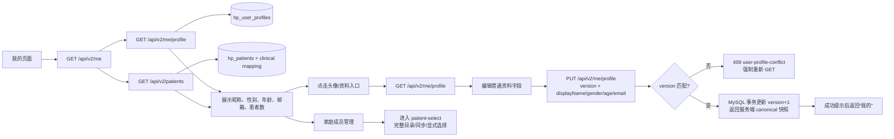

头像、手机号、真实姓名、身份证等字段不会借普通资料接口写入；“我的挂号、报告目录、门诊缴费”在没有当前 ready 患者时会进入就诊人选择页，而不是先发一个必然失败的业务请求。
“爽约记录”是一个有意的入口例外：从“我的”页只要求平台会话已验证，缺少当前患者时在本页展示可重试错误态；只有用户明确点击本页的“更换就诊人”才进入选择页，不能把业务入口自动替换成选择模块。

### 12.1 普通资料保存的字段和并发规则

普通资料接口只处理用户自己的展示资料，不处理医疗身份：

| 字段/动作 | 是否由本接口处理 | 说明 |
| --- | --- | --- |
| 昵称 `displayName` | 是 | 写入用户资料读模型，返回服务端 canonical 值 |
| 性别 `gender` | 是 | 受运行时 schema 和 service 校验 |
| 年龄 `age` | 是 | 受范围校验；不是根据身份证自动推导的医疗档案 |
| 邮箱 `email` | 是 | 按普通资料格式校验 |
| 头像、手机号、真实姓名、身份证 | 否 | 当前没有通过该接口写入的业务链路 |
| `version` | 必须带 | 用于乐观并发控制，防止旧页面覆盖新保存 |

保存过程是：页面先 GET 当前 profile → 用户编辑 → PUT 携带原 `version` → Service 检查未知字段和字段值 → MySQL 事务更新并把 version 加 1 → 返回新的 canonical profile。若期间另一个页面已经保存过，version 不匹配返回 `409 user-profile-conflict`，页面必须重新 GET 后再让用户决定是否重填，不能自动覆盖。

## 13. 支付、微信通知与 worker 补偿链路（代码存在，默认关闭）

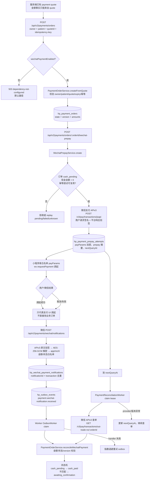

支付状态只能沿 `packages/domain/src/payment-state.ts` 的显式边迁移；前端调起成功、一次 HTTP 200 或未验签的 Provider 结果都不等于业务完成。Worker 只有在完整支付配置、持久化密钥、DB/schema 探针全部通过后才进入 provider 循环。

### 13.1 为什么支付代码存在，但用户现在不能完成支付

支付链路需要同时满足“页面有入口、服务端 gate 打开、订单事实存在、微信通知可闭环”四个条件。当前代码只证明后面三层的实现边界，不能证明用户端已经开放：

1. **订单事实**：服务端先从 quote 得到金额，创建 `hp_payment_orders`；客户端不能自行提交金额，也不能把门诊账单金额直接当作 quote。
2. **支付闸门**：`paymentsModule` 在创建订单、预支付、查询和通知等入口调用 `ensureWechatPaymentEnabled`。只要 `WECHAT_PAYMENT_READY`、商户证书、APIv3 密钥、支付回调配置或依赖探针有一项不满足，就返回 `503 dependency-not-configured`。
3. **预支付**：`POST /api/v2/payments/orders/:orderId/wechat-prepay` 只在订单为 `cash_pending`、现金金额大于 0 且幂等尝试可用时调用微信 `/v3/pay/transactions/jsapi`，并把支付参数加密保存。
4. **小程序调起**：理论上小程序拿到服务端白名单 `payParams` 后调用 `wx.requestPayment`；但当前 `outpatient-payment` 页面没有调用 `launchWechatPayment`，所以用户点击现有账单不会走到这一步。
5. **最终确认**：即使微信 UI 显示“调起成功”，订单仍保持待确认，直到微信通知验签解密成功，或者后台查单得到合法状态并完成金额/version 校验。
6. **异步补偿**：通知先去重写入 `hp_wechat_payment_notifications`，再写 `hp_outbox_events`；Worker 消费 outbox，失败指数退避。另一个 reconciliation worker 按 `nextQueryAt` 查微信订单，不能跳过状态机直接改成已支付。

用户可理解的结论是：当前页面的“待缴费”是账单查询结果，不是已开放支付按钮；支付 API 是后端预留/条件能力，不能因为 `api-client.ts` 中存在 `launchWechatPayment` 函数就认为线上可付款。

## 14. 统一错误与旧响应保护

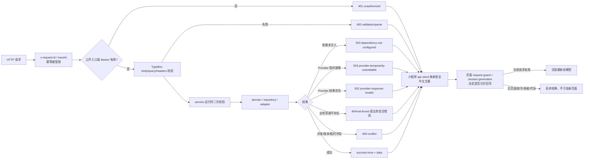

保护规则贯穿各层：HTTP 层不静默吞掉未知字段，service 不依赖 TypeScript 类型作为运行时事实，adapter 白名单投影 Provider 响应，页面不把旧患者/旧账号响应写回当前页面，错误文案不直接展示 Provider 原文。

### 14.1 常见错误码翻译成用户能理解的结果

| HTTP/业务错误 | 真正含义 | 页面应该做什么 | 不应该做什么 |
| --- | --- | --- | --- |
| `400 validation/parse` | 用户输入、日期、状态、header 或未知字段不符合接口契约 | 提示输入需要调整，保留可编辑页面 | 不要重试同一个非法请求 |
| `401 unauthorized` | Bearer 不存在、过期或 Redis 中查不到 | 清理当前登录展示态，进入登录 | 不要把数据库故障也强制踢到登录页 |
| `403`/患者归属错误 | 当前用户不能访问这个患者或资源 | 要求重新选择当前就诊人 | 不要用另一个患者 ID 重试 |
| `404 not-found` | 资源不存在、报告引用过期或被安全隐藏 | 显示“记录/详情暂不可用” | 不要猜 Provider ID 再请求 |
| `409 conflict` | 并发版本、同步 lease、幂等操作冲突 | reload 或等待前一次操作结束 | 不要覆盖别人的 profile/同步结果 |
| `502 provider-response-invalid` | 外部系统响应到了，但结构/金额/日期不符合契约 | 显示外部数据暂不可用并允许稍后重试 | 不要把非法响应渲染成正常空数据 |
| `503 dependency-not-configured` | 服务端没有注入必要依赖或 gate 未打开 | 显示功能暂未开放/服务暂不可用 | 不要让用户反复登录或反复点击付款 |
| `503 provider-temporarily-unavailable` | 外部系统或网络暂时故障 | 允许稍后重试，保留当前页面安全状态 | 不要把失败结果写入患者/支付状态 |

页面收到成功响应后也不一定会渲染：客户端还要检查当前请求是否属于当前页面、当前 session generation 和当前 patientId。这样可以避免“用户已经切换到患者 B，但患者 A 的慢请求最后返回并覆盖页面”的数据串线。

## 15. 当前页面和 API 能力矩阵

| 用户入口 / 动作 | 实际调用 | 当前状态 | 关键边界 |
| --- | --- | --- | --- |
| 首页打开 | `GET /health/live`；有缓存 token 时 `GET /me`、`GET /patients` | 已实现 | live 不等于 ready；恢复失败清空展示态 |
| 微信登录 | `POST /auth/wechat` → 微信 `code2session` → Redis session | 已实现但需真实配置/真机验收 | 小程序只提交 code；provider secret 不出服务端 |
| 新增/更换就诊人 | `GET /patients`、`POST /patients/sync` | 已实现边界 | operation ledger、租约、完整快照、临床映射 |
| 预约科室 | `GET /appointments/departments` → 众阳 AMC | 只读已实现 | 服务端最多未来 7 天；无写入 |
| 预约排班 | `GET /appointments/schedules` → 众阳 AMC | 只读已实现 | 生成 opaque `scheduleId`；排班快照为未来前置事实 |
| 点击号源下单 | 无真实写入请求 | 未开放 | 页面 Toast“预约下单功能迁移中” |
| 我的挂号 | `GET /appointments/records` → 众阳预约记录 | 只读已实现 | 过去/未来 90 天窗口 |
| 爽约记录 | 同一 `GET /appointments/records` | 只读已实现 | 仅过去 90 天；不是另一个 Provider endpoint |
| 报告目录 | `GET /reports` → LIS/PACS/ECG 三路目录 | 只读已实现 | 最近 30 天；三路聚合整批校验 |
| 检验详情 | `GET /reports/:reportId` → 短期引用 → LIS detail | 条件开放 | 详情 gate、引用 TTL、owner+patient+reportId 三重绑定 |
| 云影像/分享/复诊 | 无真实接口 | 未开放 | 详情页只显示迁移提示 |
| 门诊费用 | `GET /payments/outpatient/records` → 众阳费用只读 | 只读已实现 | 最近 30 天、unpaid/paid；不调支付 |
| 普通资料读取 | `GET /me/profile` | 已实现 | canonical read model |
| 普通资料保存 | `PUT /me/profile` | 已实现 | version 乐观并发控制；未知字段拒绝 |
| 微信支付订单/预支付 | `/payments/orders*`、`/wechat-prepay` | 代码存在、默认关闭 | quote 金额、幂等、APIv3 签名/验签、通知闭环 |
| 微信支付通知 | `POST /payments/wechat/notifications` | 代码存在、默认关闭 | 验签、解密、白名单、去重、outbox |
| 支付补偿 worker | outbox + 查单 | 代码存在、默认 inactive | 完整配置/DB/schema/密钥 gate |
| 健康百科 | `apps/api/src/modules/knowledge` 已挂载只读 module | 当前受保护且 fail-closed | 没有有效 published bundle 时返回稳定不可用错误；不能写成内容已发布 |
| 智能客服/导诊/互联网医院 | 页面入口或迁移提示 | 未迁移/静态 | 不把 UI 占位当作后端能力 |
| 院内导航 | 本地地图 + `wx.previewImage` | 静态已实现 | 无实时路线、楼层定位或导航 API |
| 意见反馈 | 静态问题 + 电话拨号 | 无在线工单 | 点击反馈只 Toast，不代表已提交 |

### 15.1 公网接口、内部接口和外部接口的对照

用户实际在小程序里看到/触发的是“公网接口”；后端日志里通常显示“内部接口”；众阳或微信接口属于第三套地址。三套地址不能混写成一个接口。

| 业务 | 小程序实际请求 | API 内部路由 | 服务端最终访问 | 中文解释 |
| --- | --- | --- | --- | --- |
| 登录 | `POST /api/v2/auth/wechat` | `POST /api/v1/auth/wechat` | 微信 `GET /sns/jscode2session` | 用一次性 code 换内部登录会话 |
| 当前用户 | `GET /api/v2/me` | `GET /api/v1/me` | Redis session | 确认 Bearer 对应哪个内部用户 |
| 患者列表 | `GET /api/v2/patients` | `GET /api/v1/patients` | MySQL 患者快照 | 读取当前用户自己的患者目录 |
| 患者同步 | `POST /api/v2/patients/sync` | `POST /api/v1/patients/sync` | 众阳患者目录 + MySQL 事务 | 拉取、校验、映射并保存患者快照 |
| 预约科室 | `GET /api/v2/appointments/departments` | `GET /api/v1/appointments/departments` | 众阳 AMC `scheduling-depts` | 查询可预约科室，不创建预约 |
| 预约排班 | `GET /api/v2/appointments/schedules` | `GET /api/v1/appointments/schedules` | 众阳 AMC `schedulings` | 查询医生/日期/时段/剩余号源 |
| 挂号/爽约记录 | `GET /api/v2/appointments/records` | `GET /api/v1/appointments/records` | 众阳预约记录 | 查询历史摘要，不是挂号下单 |
| 报告目录 | `GET /api/v2/reports` | `GET /api/v1/reports` | 众阳 LIS/PACS/ECG | 汇总报告摘要 |
| 报告详情 | `GET /api/v2/reports/:reportId` | `GET /api/v1/reports/:reportId` | 众阳 LIS detail | 只接受服务端生成且未过期的短期引用 |
| 门诊费用 | `GET /api/v2/payments/outpatient/records`、`GET /api/v2/payments/outpatient/records/{recordId}` | `GET /api/v1/payments/outpatient/records`、`GET /api/v1/payments/outpatient/records/{recordId}` | 众阳 open-settlepay | 查询账单状态和已核对摘要，不等于付款 |
| 普通资料 | `GET/PUT /api/v2/me/profile` | `GET/PUT /api/v1/me/profile` | MySQL `hp_user_profiles` | 读写普通展示资料 |
| 微信支付 | `/api/v2/payments/orders*` | `/api/v1/payments/orders*` | 微信支付 APIv3 | 代码存在，但当前 gate 默认关闭 |

读接口中的 `GET` 表示“读取”，不表示一定来自数据库；例如预约科室/排班主要来自众阳。写接口中的 `POST/PUT` 也不表示一定已开放给用户；例如患者同步已接入，而预约下单和微信支付仍受页面入口/运行闸门限制。

## 16. 源码索引

| 层 | 关键入口 | 用来回答什么问题 |
| --- | --- | --- |
| 小程序页面 | [`apps/miniprogram/src/app.json`](../../apps/miniprogram/src/app.json)、[`pages/index/index.ts`](../../apps/miniprogram/src/pages/index/index.ts)、[`services/api-client.ts`](../../apps/miniprogram/src/services/api-client.ts)、[`services/session-service.ts`](../../apps/miniprogram/src/services/session-service.ts)、[`services/dashboard-service.ts`](../../apps/miniprogram/src/services/dashboard-service.ts) | 用户点击什么、页面何时加载、请求如何发出、旧响应是否允许回写 |
| API 组合根 | [`apps/api/src/app.ts`](../../apps/api/src/app.ts)、[`apps/api/src/application.ts`](../../apps/api/src/application.ts)、[`apps/api/src/index.ts`](../../apps/api/src/index.ts) | 哪些模块真正注册、哪些 Adapter/Repository 被注入、启动时哪些能力被 gate |
| API 路由 | [`apps/api/src/modules/auth/index.ts`](../../apps/api/src/modules/auth/index.ts)、[`patients/index.ts`](../../apps/api/src/modules/patients/index.ts)、[`appointments/index.ts`](../../apps/api/src/modules/appointments/index.ts)、[`reports/index.ts`](../../apps/api/src/modules/reports/index.ts)、[`outpatient-payments/index.ts`](../../apps/api/src/modules/outpatient-payments/index.ts)、[`payments/index.ts`](../../apps/api/src/modules/payments/index.ts)、[`profile/index.ts`](../../apps/api/src/modules/profile/index.ts) | URL、HTTP 方法、header/query/body 校验以及请求进入哪个 service |
| 业务 service | `apps/api/src/modules/*/service.ts`；门诊费用 service 与 route 同在 `outpatient-payments/index.ts` | owner/patient 归属、日期范围、幂等、状态、Provider 映射和错误分类 |
| 外部适配器 | [`packages/adapters/src/wechat-identity.ts`](../../packages/adapters/src/wechat-identity.ts)、[`wechat-pay.ts`](../../packages/adapters/src/wechat-pay.ts)、[`zhongyang-patients.ts`](../../packages/adapters/src/zhongyang-patients.ts)、[`zhongyang-appointments.ts`](../../packages/adapters/src/zhongyang-appointments.ts)、[`zhongyang-reports.ts`](../../packages/adapters/src/zhongyang-reports.ts)、[`zhongyang-outpatient-payments.ts`](../../packages/adapters/src/zhongyang-outpatient-payments.ts) | 平台最终访问哪个外部 URL、传哪些 Provider 参数、如何验签和归一化响应 |
| 持久化 | [`packages/persistence/src/runtime.ts`](../../packages/persistence/src/runtime.ts)、[`mysql-repositories.ts`](../../packages/persistence/src/mysql-repositories.ts)、[`redis-session.ts`](../../packages/persistence/src/redis-session.ts)、[`migrations/`](../../packages/persistence/migrations/) | 哪些数据保存到 MySQL、哪些 token/lease 保存到 Redis、同步/报告/支付如何留痕 |
| Worker | [`apps/worker/src/runtime.ts`](../../apps/worker/src/runtime.ts)、[`outbox-worker.ts`](../../apps/worker/src/outbox-worker.ts)、[`payment-reconciliation-worker.ts`](../../apps/worker/src/payment-reconciliation-worker.ts)、[`wechat-payment-notification-handler.ts`](../../apps/worker/src/wechat-payment-notification-handler.ts) | 支付通知如何异步落单、失败如何重试、查单如何推动状态机 |
| CodeGraph | `.codegraph/codegraph.db`（本机静态索引快照；不是业务运行时依赖） | 函数、方法、import、calls 的候选关系；同名符号仍需源码复核 |
| 运行边界 | [`infra/nginx/test-hp.meiyi.pro.conf.example`](../../infra/nginx/test-hp.meiyi.pro.conf.example)、[`README.md`](../../README.md)、[`docs/迁移/API矩阵.md`](../迁移/API矩阵.md) | 公网 `/api/v2` 如何转发、当前发布边界和哪些功能仍在迁移 |
