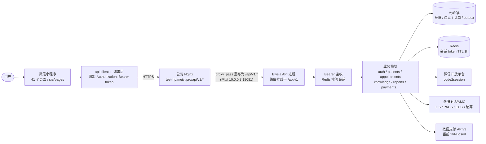
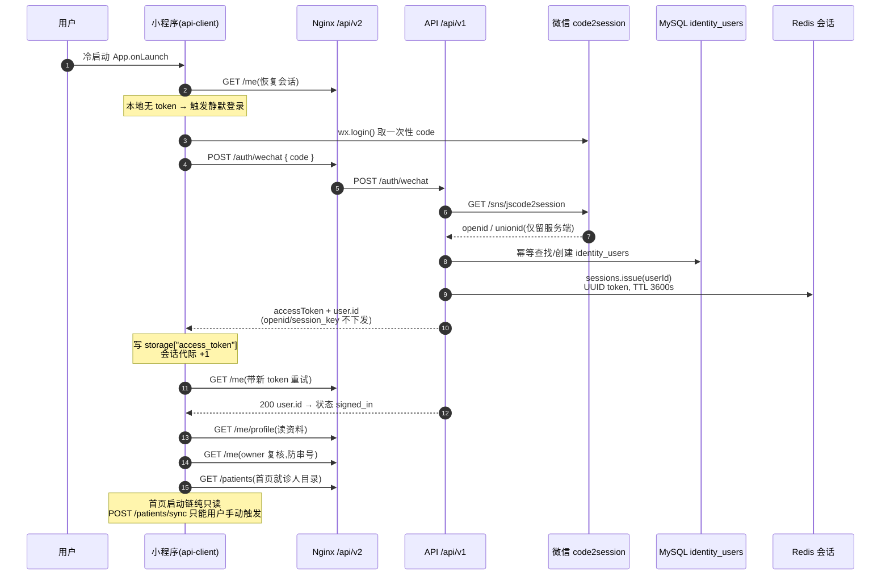
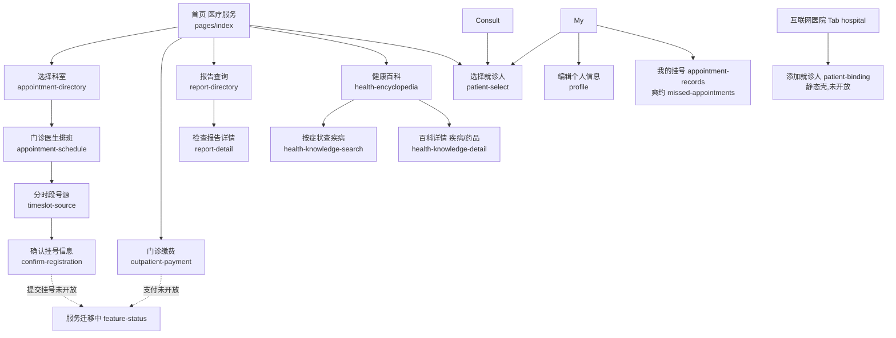
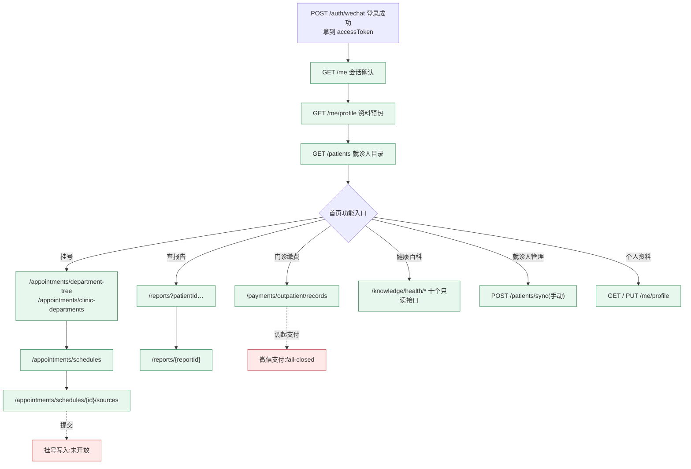

# 微信登录与接口流向图

> 审计基线:2026-09-03。本文按当前工作区实际注册的路由(`apps/api/src/app.ts`)、小程序请求层(`apps/miniprogram/src/services/api-client.ts`)与页面代码逐行核对绘制;"代码存在"不等于"用户入口已开放",未开放项在 §7 单独标注。

---

## 1. 全局链路总览

所有业务请求都走同一条通道,只有前缀不同:

**路径规则**(小程序 `app.ts` globalData 硬编码):

| 环境 | Base URL | 前缀 | 说明 |
| --- | --- | --- | --- |
| 线上小程序 | `https://test-hp.meiyi.pro` | `/api/v2` | 已备案 HTTPS 域名,Nginx 把 `/api/v2/*` 重写转发到 API 进程的 `/api/v1/*`(`infra/nginx/test-hp.meiyi.pro.conf.example`) |
| 本地开发 | `http://127.0.0.1:…` | `/api/v1` | 直连 API 进程 |

下文接口清单中的路径均为**去掉前缀后的业务路径**(如 `/auth/wechat` 实际请求 `https://test-hp.meiyi.pro/api/v2/auth/wechat`)。

---

## 2. 微信登录链路(核心时序)

小程序**没有** `wx.checkSession`,也不用微信侧会话;会话有效性一律由服务端 `GET /me` 验证。登录在 App 冷启动时静默发生,也在用户点击需要登录的入口时显式发生。

### 登录后 token 的用法

- 请求头:`Authorization: Bearer <accessToken>`(不透明 UUID,非 JWT),所有请求另带 `x-request-id`;写操作必须带 `idempotency-key`。
- **401 处理规则**(`requestWithSession`):
  - GET 401 → 清 token → 重新 `wx.login` 换 code → 重试**一次**(防循环);
  - 非 GET(POST/PUT)401 → **绝不自动重放**,只清本地会话,由用户重新发起(防旧请求体/幂等键跨账号写入);
  - 患者范围只读请求(`/appointments/records`、`/reports`、`/payments/outpatient/records`)走更严格的 `requestWithStableSession`:不自动登录、不重放。
- **无 refresh-token 端点、无登出端点**:过期即重新走 `/auth/wechat` 全量换新;服务端靠 Redis TTL 自然过期。

### 本地存储 Key

| Storage Key | 内容 |
| --- | --- |
| `access_token` | Bearer token(≤512 字符) |
| `selected_patient_id` | 当前选中就诊人的平台内部 patientId |
| `wechat-user-profile:{ownerId}` | 当前用户微信昵称/头像本机缓存 |
| `api_base_url` / `api_prefix` | 旧版本残留,只读兜底,代码不再写入 |

---

## 3. 登录后的去往:页面导航结构

入口页 `pages/index/index`(首页"医疗服务"),TabBar 共 4 个:**医疗服务(index)| 就诊(consult)| 互联网医院(hospital)| 我的(my)**。

---

## 4. 接口全景清单(按后端模块)

鉴权列:`公开` = 无需 token;`Bearer` = 需 `Authorization: Bearer <token>`。"后端去往"指服务端进一步调用的外部系统。

### 4.1 auth — 登录与会话

| 方法 | 路径 | 鉴权 | 作用 | 后端去往 |
| --- | --- | --- | --- | --- |
| POST | `/auth/wechat` | 公开 | **唯一登录端点**:小程序 `wx.login` 的一次性 code 换平台会话,返回 accessToken + user.id | 微信 `GET /sns/jscode2session` → MySQL `identity_users` 幂等落库 → Redis 签发 token(TTL 3600s) |
| GET | `/me` | Bearer | 会话恢复/校验,返回当前 userId(小程序用它代替 wx.checkSession) | Redis 校验 token |

### 4.2 profile — 普通资料

| 方法 | 路径 | 鉴权 | 作用 | 后端去往 |
| --- | --- | --- | --- | --- |
| GET | `/me/profile` | Bearer | 读当前用户资料(昵称/性别/年龄等) | MySQL `user_profiles` |
| PUT | `/me/profile` | Bearer | 改资料,带 version 乐观锁,冲突 409 | MySQL `user_profiles` |

### 4.3 patients — 就诊人

| 方法 | 路径 | 鉴权 | 作用 | 后端去往 |
| --- | --- | --- | --- | --- |
| POST | `/patients/sync` | Bearer + `idempotency-key` 头必填 | 从 HIS 同步当前微信用户绑定的就诊人档案(60s 同步租约防并发);**只能用户显式触发** | 众阳 HIS `/msun-middle-aggregate-patient/v1/patInfosFind`、旧接口 `/api/public/patientInfoByUnionId` |
| GET | `/patients` | Bearer | 读已同步的就诊人列表(owner-scoped,列表过期会自动触发目录刷新) | MySQL(必要时 HIS) |

### 4.4 appointments — 挂号预约(全部只读)

| 方法 | 路径 | 鉴权 | 作用 | 后端去往 |
| --- | --- | --- | --- | --- |
| GET | `/appointments/departments` | Bearer | 扁平可预约科室目录(**页面未使用**,仅测试) | 众阳 AMC `…/v1/schedulings/scheduling-depts` |
| GET | `/appointments/department-tree` | Bearer | 一级/二级科室树(选择科室页使用) | 众阳 `…/v1/first-depts` |
| GET | `/appointments/clinic-departments?parentDepartmentId=` | Bearer | 按二级科室查受控三级门诊科室 | 众阳 AMC |
| GET | `/appointments/schedules?startDate&endDate[&departmentId][&doctorId]` | Bearer | 排班列表,并持久化排班快照 | 众阳 `…/v1/schedulings` |
| GET | `/appointments/schedules/{scheduleId}/sources` | Bearer | 单排班的分时段号源(scheduleId 为短期 opaque 引用,过期 404) | 众阳 `…/v1/sources/{id}` |
| GET | `/appointments/records?patientId[&scope=online\|all][&startDate][&endDate]` | Bearer | 预约历史(校验 patientId 归属当前登录用户) | 众阳 `/msun-middle-business-appointment-server/v1/appointment-infos/{patId}` |

### 4.5 knowledge — 健康百科(全部只读,读 MySQL 审核内容,无外部调用)

| 方法 | 路径 | 鉴权 | 作用 |
| --- | --- | --- | --- |
| GET | `/knowledge/health/part/list` | Bearer | 按身体部位分类目录 |
| GET | `/knowledge/health/crowd/list` | Bearer | 按人群分类目录 |
| GET | `/knowledge/health/department/list` | Bearer | 按科室分类目录 |
| GET | `/knowledge/health/symptoms/list/part/{partId}` | Bearer | 按部位列症状 |
| GET | `/knowledge/health/disease/list/part/{partId}` | Bearer | 按部位列疾病 |
| GET | `/knowledge/health/disease/list/crowd/{crowdId}` | Bearer | 按人群列疾病 |
| GET | `/knowledge/health/disease/list/department/{departmentId}` | Bearer | 按科室列疾病 |
| GET | `/knowledge/health/disease/list/symptoms?symptomIds=`(1–10 个) | Bearer | 按多症状组合查疾病 |
| GET | `/knowledge/health/disease/detail/{diseaseId}` | Bearer | 疾病详情 |
| GET | `/knowledge/health/drug/detail/{drugId}` | Bearer | 药品详情 |

### 4.6 reports — 检查报告

| 方法 | 路径 | 鉴权 | 作用 | 后端去往 |
| --- | --- | --- | --- | --- |
| GET | `/reports?patientId&startDate&endDate[&kind=laboratory\|imaging\|ecg]` | Bearer | 报告列表,按 kind 路由到不同系统 | 众阳 LIS `/msun-middle-business-lis/v1/lis-reports-filter`、PACS `/msun-middle-business-pacs/v1/exclude-privacy-patient-reports`、ECG `/msun-middle-business-ecg/v2/ecg-reports` |
| GET | `/reports/{reportId}?patientId=` | Bearer | 报告详情(仅检验 laboratory 实装) | LIS `/msun-middle-business-lis/v1/lis-reports/details` |

### 4.7 payments — 门诊费用与微信支付

| 方法 | 路径 | 鉴权 | 作用 | 后端去往 |
| --- | --- | --- | --- | --- |
| GET | `/payments/outpatient/records?patientId&status` | Bearer | 最近 30 天门诊费用只读列表(待缴/已缴) | 众阳 `/msun-middle-open-settlepay/v1/outpatient-payments/outpatient-child-payment-records` |
| POST | `/payments/orders` | Bearer + `idempotency-key` | 从服务端报价创建支付订单(**页面未使用**) | MySQL 订单 + outbox |
| POST | `/payments/orders/{orderId}/wechat-prepay` | Bearer + `idempotency-key` | 创建 JSAPI 预支付,openid 只从服务端身份表读(**页面未使用**) | 微信支付 `POST /v3/pay/transactions/jsapi` |
| GET | `/payments/orders/{orderId}/wechat-prepay` | Bearer + `idempotency-key` | 查询预支付状态(**页面未使用**) | — |
| GET | `/payments/orders/{orderId}` | Bearer | 订单安全读模型(**页面未使用**) | MySQL |
| POST | `/payments/wechat/notifications` | 公开(微信服务器) | 微信支付 APIv3 回调:验签+解密 → 落库去重(依赖支付闸门) | 平台公钥 + APIv3 key |

> 整个 payments 模块受 `wechatPaymentEnabled` 闸门(默认关闭):需 `WECHAT_PAYMENT_READY` + 完整商户配置同时就绪,否则一律 503。

### 4.8 health / system — 探针(无前缀例外)

| 方法 | 路径 | 鉴权 | 作用 |
| --- | --- | --- | --- |
| GET | `/health/live` | 公开 | 存活探针(首页 `checkHealth` 用它) |
| GET | `/health/ready` | 公开 | 就绪探针,返回 database/redis/schema 三项依赖状态 |
| GET | `/system/ping` | 公开 | 进程级连通性,不探测依赖 |

### 4.9 后台 worker(与接口链路衔接)

- **OutboxWorker**:消费 MySQL outbox 事件,处理 `payment.wechat-notification.received`(据微信回调推进订单状态机),失败指数退避 1s→15min,12 次后进 `manual_review`。
- **PaymentReconciliationWorker**:支付补偿查单,调微信 `GET /v3/pay/transactions/out-trade-no/{orderId}`,按订单版本+金额校验后更新。
- 医保结算对账 worker:仓储端口未实装前 runtime 不注册。

---

## 5. 页面 → 接口映射(按功能分区)

通用模式说明:
- `登录链` = POST `/auth/wechat`(按需,无 token 时自动)→ GET `/me` → GET `/me/profile` → GET `/me`(owner 复核);
- `患者上下文` = GET `/me` → GET `/patients` → GET `/me`(关闭态外壳页统一用这个三连,只读);
- 页面共 41 个,真正有业务数据接口的约 20 个;纯静态/占位 8 个(见 §7)。

### 首页区

| 页面 | 用途 | 接口 |
| --- | --- | --- |
| `index` | 首页工作台 | GET `/health/live`;登录链;GET `/patients`;用户点同步时 GET `/me` + POST `/patients/sync` |
| `official-account` | 公众号宣传 | 无(静态) |
| `hospital-navigation` | 院内导航 | 无(静态) |

### 挂号预约区

| 页面 | 用途 | 接口 |
| --- | --- | --- |
| `appointment-directory` | 选择科室(两级级联+三级) | GET `/appointments/department-tree`;GET `/appointments/clinic-departments?parentDepartmentId=` |
| `appointment-schedule` | 门诊医生排班(7 天窗口) | GET `/appointments/schedules?startDate&endDate&departmentId[&doctorId]` |
| `timeslot-source` | 分时段号源 | GET `/appointments/schedules/{scheduleId}/sources` |
| `confirm-registration` | 确认挂号信息 | 患者上下文(GET `/me`+`/patients`);**提交无接口**,跳 feature-status |
| `appointment-records` | 我的挂号(在线/全部) | 患者上下文;GET `/appointments/records?patientId&scope=online|all`(±90 天) |
| `missed-appointments` | 爽约记录 | 患者上下文;GET `/appointments/records?patientId&scope=online`(过去 90 天) |
| `blood-appointment` | 采血预约(关闭态) | 患者上下文;写入跳 feature-status |
| `consult` | 就诊 Tab(挂号总览) | 登录链;GET `/patients`;GET `/appointments/records?patientId&scope=all` |

### 缴费区

| 页面 | 用途 | 接口 |
| --- | --- | --- |
| `outpatient-payment` | 门诊缴费(待缴/已缴) | 患者上下文;GET `/payments/outpatient/records?patientId&status=unpaid` 和 `status=paid`。**不调 wx.requestPayment**,点击记录跳 feature-status |

### 报告区

| 页面 | 用途 | 接口 |
| --- | --- | --- |
| `report-directory` | 报告查询 | 患者上下文;GET `/reports?patientId&startDate&endDate`(过去 30 天) |
| `report-detail` | 检查报告详情(LIS) | 患者上下文;GET `/reports/{reportId}?patientId=` |

### 健康科普区

| 页面 | 用途 | 接口 |
| --- | --- | --- |
| `health-encyclopedia` | 健康百科(部位/人群/科室) | GET `/knowledge/health/part|crowd|department/list`;`/symptoms/list/part/{partId}`;`/disease/list/{part|crowd|department}/{id}` |
| `health-knowledge-search` | 按症状查疾病 | GET `/knowledge/health/disease/list/symptoms?symptomIds=` |
| `health-knowledge-detail` | 疾病/药品详情 | GET `/knowledge/health/disease/detail/{diseaseId}`;`/drug/detail/{drugId}` |
| `health-test` | 健康自测(BMI 等本地工具) | 无(本地计算) |

### 患者管理 / 我的 / 其他

| 页面 | 用途 | 接口 |
| --- | --- | --- |
| `patient-select` | 统一就诊人选择器(被 10+ 页引用) | GET `/patients`;用户点刷新时 GET `/me` + POST `/patients/sync`;选中写 storage `selected_patient_id` |
| `patient-binding` | 添加就诊人(实名绑定) | 无(静态壳,契约未接入) |
| `patient-agreement` | 使用条款 | 无(静态) |
| `patient-signature` | 就诊人签名 | GET `/patients`;提交跳 feature-status |
| `profile` | 编辑个人信息 | 登录链;PUT `/me/profile`(保存,乐观锁) |
| `my` | 我的 Tab | 登录链;GET `/patients` + GET `/me`;微信头像昵称授权后 PUT `/me/profile` 回写 |
| `hospital` | 互联网医院 Tab | 无(纯导航壳) |
| `hospital-list` | 医院列表 | GET `/me`(恢复会话后导航) |
| `feedback` | 意见反馈 | 无(本地文案) |
| `smart-customer` | 智能客服(关闭态) | 患者上下文三连 |

### 关闭态/迁移占位页(统一只读患者上下文三连:GET `/me` → GET `/patients` → GET `/me`)

`electronic-consultation`(电子导诊单)、`inpatient-center`(住院信息)、`my-doctor`(我的医生)、`admission-preconsultation`(入院预问诊)、`discharge-followup`(出院随访)、`pre-visit`(预约前预问诊)、`risk-evaluation`(风险评估)、`gift-banner`(电子锦旗)、`health-praise`(表扬信)、`feature-status`(服务迁移中说明页,无接口)。

---

## 6. 一张图看懂"登录之后去哪儿"

---

## 7. 当前状态盘点(哪些通、哪些不通)

**已开放可用(绿)**:
- 微信登录 + Redis 会话 + 静默重登;
- 患者目录读取 + 手动 HIS 同步;
- 预约全链路**只读**(科室树 → 排班 → 号源 → 历史记录/爽约);
- 报告列表 + 检验(LIS)详情;
- 门诊费用只读列表;
- 健康百科 10 个只读接口(模块已挂载,旧文档"不可达"结论已过时);
- 普通资料读/写。

**能力已备、入口未开放(黄)**:
- `POST/GET /payments/orders…/wechat-prepay`(微信预支付,api-client 已实现,无页面调用,且后端闸门默认关);
- `GET /appointments/departments`(扁平科室目录,仅测试使用)。

**关闭态/占位(红,统一跳 feature-status)**:
- 挂号提交/锁号/取消、采血预约、门诊缴费调起与详情、医保结算、智能客服、实名绑定添加就诊人、住院/预问诊/随访/风险评估等 9 个外壳页;
- 静态无接口页:official-account、hospital-navigation、patient-agreement、patient-binding、feedback、health-test、hospital、feature-status。

**无对应端点**:登出、token 刷新(过期即重新登录)。
